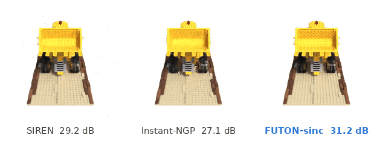

<p align="center">
  
</p>

<h1 align="center">NeuroField</h1>

<p align="center">
  <b>Neural fields in PyTorch</b>, with FUTON, a Fourier Tensor Network for implicit neural representations.
</p>

<p align="center">
  <a href="https://arxiv.org/abs/2602.13414"></a>
  <a href="https://pashtari.github.io/neurofield/"></a>
  
  
  <a href="LICENSE"></a>
</p>

NeuroField fits a signal as a function of its coordinates. It provides **FUTON**, the model of the paper; **eleven baselines** (SIREN, FINER, WIRE, Gauss, MFN, RFF, PE-MLP, Instant-NGP, TensoRF, GA-Planes, Deep Image Prior) behind the same interface; **coordinate datasets** for images, occupancy volumes, MRI k-space and posed views; **one training loop** with evaluation, quantization and logging; and two applications, **image compression** and **novel view synthesis**. The experiments of the paper are its configs and scripts, run as they are.

<p align="center">
  
</p>

## Why FUTON

Most implicit neural representations hide their prior in the nonlinearity: sines, Gabor wavelets, Gaussians, or a hash-grid lookup in front of a ReLU network. FUTON puts the prior in the parameterization. The signal is expanded in a fixed, analytic basis along each coordinate axis, and the coefficient tensor of that expansion is stored in low-rank canonical polyadic (CP) form. The model is a shallow, parallel tensor contraction rather than a deep network:

- **Fast.** A point costs O(CKR) for C axes, K basis functions per axis and rank R. With a compactly supported basis (Lanczos) only 2a taps per axis are touched, and fused Triton kernels contract them without forming dense features.
- **Accurate at equal size.** At matched parameter counts FUTON leads every baseline on the average of each benchmark: Kodak images, Stanford occupancy volumes and Blender radiance fields.
- **Transparent.** With a linear decoder FUTON *is* a rank-R CP model of the signal in the chosen basis, so bandwidth (K) and capacity (R) are explicit knobs.

## Results

Every model of a task has the same parameter budget, the hyperparameters of its authors' code, and a learning rate chosen on the task. Times are mean training times per signal on one A100. The [benchmarks page](https://pashtari.github.io/neurofield/experiments/benchmarks/) has every model, metric and error bar.

| Task | Signals | Params | FUTON-sinc | FUTON-lanczos | Strongest baseline |
| --- | --- | --- | --- | --- | --- |
| Images (Kodak) | 24 | 195k | **38.54 dB** in 8.1 s | 38.20 dB in **6.6 s** | Instant-NGP, 36.76 dB in 26.9 s |
| Occupancy (Stanford) | 5 | 132k | **99.90 % IoU** in 11.2 s | **99.90 % IoU** in 8.8 s | Instant-NGP, 99.87 % in 26.7 s |
| Radiance fields (Blender) | 8 | 75k | **28.95 dB** in 343 s | 28.93 dB in **315 s** | FINER, 28.85 dB in 445 s |

<p align="center">
  
</p>
<p align="center">
  <sub>Kodak: PSNR against training time for FUTON and the strongest model of each family (left), and every model's final PSNR against its training time (middle) and its inference rate in images per second (right).</sub>
</p>
<p align="center">
  
</p>
<p align="center">
  
</p>

## Installation

Python 3.11+ and PyTorch 2.10+. A GPU is optional; Triton, which ships with PyTorch's Linux CUDA wheels, enables the fused kernels for the local bases.

```bash
git clone https://github.com/pashtari/neurofield.git
cd neurofield
pip install -e .
```

Extras: `3d` (meshes as occupancy volumes, mesh export and rendering), `nerf` (nerfacc ray marching and video export), `dev` (black, pytest), `docs` (this site).

```bash
pip install -e ".[3d,nerf,dev]"
```

## Quick start

Fit FUTON to an image and score it. On a GPU this takes about ten seconds and reaches about 37 dB.

```python
import torch
import neurofield as nf

image = "data/Kodak/kodim19.png"                              # any RGB image
dataset = nf.ImageCoordinateDataset(image)                   # every pixel, for evaluation
train_set = nf.ImageCoordinateDataset(image, subsample=0.1)  # 10 % of the pixels per step

model = nf.FUTON(
    in_features=2,
    out_features=3,
    basis=("sinc", {"num_components": 256, "grid_size": dataset.grid_size}),
    combiner=("cp", {"rank": 224}),
    decoder=("mlp", {"hidden_layers": 1}),
    output_activation=torch.tanh,
)

result = nf.train(
    model, train_set, dataset,
    num_epochs=2000, lr=3e-2,
    metrics={"psnr": nf.psnr, "ssim": nf.ssim},
    eval_interval=500,
)
print(result["history"][-1]["eval"])                         # {"psnr": 37.2, "ssim": 0.946, ...}

output = nf.chunked_inference(model, dataset.input, chunk_size=65536)  # (H, W, 3) in [-1, 1]
dataset.save(dataset.postprocess(output.cpu()), "kodim19_futon.png")
```

Coordinates live in [-1, 1] on every axis, targets in the model's output range, and `nf.train` runs Adam with cosine annealing. Every model in the zoo takes `in_features` and `out_features` first, so `nf.SIREN(2, 3, hidden_features=256, hidden_layers=4, output_activation=torch.tanh)` drops into the same call. The [quick start](https://pashtari.github.io/neurofield/getting-started/quickstart/) explains each step.

## What is in the box

**Models**, all mapping `(..., C)` coordinates in [-1, 1] to `(..., D)` values:

| Family | Models |
| --- | --- |
| FUTON | `FUTON` with bases `cosine`, `sinc`, `legendre`, `chebyshev`, `triangle`, `lanczos`; combiners `cp`, `hadamard`, `tr`; decoders `linear`, `mlp` |
| Coordinate networks | `SIREN`, `FINER`, `Gauss`, `WIRE` / `RealWIRE`, `MFN`, `RFF`, `PEMLP`, and the generic `MLP` |
| Grid and tensor models | `InstantNGP` / `HashEncoding`, `TensoRF`, `GAPlanes` / `MultiVector` / `FeatureGrid`, `GridINR` |
| Deep Image Prior | `DIPUNet`, `DIPSkip` |

**Datasets**: `ImageCoordinateDataset`, `MaskedImageCoordinateDataset`, `OccupancyCoordinateDataset`, `MRICoordinateDataset`, `DIPImageDataset`, and `nf.nerf.BlenderDataset`.

**Training and evaluation**: `nf.train`, `nf.evaluate`, `nf.chunked_inference`; metrics `psnr`, `ssim`, `ms_ssim`, `lpips`, `nmse`, `iou`, `bits_per_pixel`; losses `rate_distortion_loss`, `sdf_loss`; `uniform_quantize` / `uniform_dequantize` and quantization-aware training.

**Image compression** (`nf.compression`): a FUTON codec, PIL codecs as baselines, and one function that measures any codec.

```python
from torchvision.io import ImageReadMode, read_image

image = read_image("data/Kodak/kodim19.png", mode=ImageReadMode.RGB)
futon = nf.compression.evaluate_compression(
    image, nf.compression.encode_futon, nf.compression.decode_futon,
    basis=("cosine", {"num_components": 128}), combiner=("cp", {"rank": 64}), decoder="linear",
)
jpeg = nf.compression.evaluate_compression(
    image, nf.compression.encode_pil, nf.compression.decode_pil, format="JPEG", quality=50
)
# each: {"PSNR (dB)": ..., "bit rate (bpp)": ..., "encoding time (ms)": ..., "decoding time (ms)": ...}
```

**Novel view synthesis** (`nf.nerf`): any model as the density network of a radiance field, occupancy-grid volume rendering (nerfacc when its CUDA extension works, pure PyTorch otherwise), and PSNR / SSIM / LPIPS on held-out views.

```python
root = "data/nerf/blender/lego"
train_set = nf.nerf.BlenderDataset(root, split="train", downsample=4, skip=4)
test_set = nf.nerf.BlenderDataset(root, split="test", downsample=4)

field = nf.nerf.RadianceField(
    (nf.FUTON, {"basis": ("lanczos", {"num_components": 128, "radius": 3}),
                "combiner": ("cp", {"rank": 128}), "decoder": ("mlp", {"hidden_layers": 1})}),
    ("mlp", {"hidden_features": 64, "hidden_layers": 2}),
    aabb=train_set.aabb,
)
renderer = nf.nerf.create_renderer(aabb=train_set.aabb, near=train_set.near, far=train_set.far)
nf.nerf.train(field, renderer, train_set, num_steps=37500, lr=3e-2)
print(nf.nerf.evaluate(field, renderer, test_set)["mean"])
```

## Reproducing the paper

Three download scripts, three training scripts and one report script produce every table and figure.

```bash
python scripts/download_kodak.py         # 24 Kodak images, about 30 MB
python scripts/download_meshes.py        # 5 Stanford meshes, about 3 GB
python scripts/download_blender.py       # 8 Blender scenes, about 2.4 GB

python scripts/train_image.py            # 24 images x 12 models -> logs/image/<image>/<model>/
python scripts/train_occupancy.py        # 5 shapes x 13 models  -> logs/occupancy/<shape>/<model>/
python scripts/train_nerf.py             # 8 scenes x 13 models  -> logs/nerf/<scene>/<model>/

python scripts/report_paper.py           # tables and figures    -> results/
```

`configs/<task>.yaml` holds every model's class, constructor arguments and learning rate, with a comment wherever a setting departs from the authors' code. `--data`, `--models`, `--config`, `--set KEY=VALUE`, `--log-dir` and `--overwrite` select signals, models and settings; finished runs are skipped, so an interrupted sweep resumes. `configs/ablation-futon/` holds the ablations, and `scripts/hpc/` the Slurm scripts the sweeps ran with. See [Reproducing the paper](https://pashtari.github.io/neurofield/experiments/reproduce/).

## Documentation

The full documentation is at **[pashtari.github.io/neurofield](https://pashtari.github.io/neurofield/)**:

- [Getting started](https://pashtari.github.io/neurofield/getting-started/): installation, data, and a first neural field.
- [Concepts](https://pashtari.github.io/neurofield/concepts/): how models, datasets and the training loop fit together; [FUTON](https://pashtari.github.io/neurofield/concepts/futon/) stage by stage; the [model zoo](https://pashtari.github.io/neurofield/concepts/models/); [conventions](https://pashtari.github.io/neurofield/concepts/conventions/).
- [Tutorials](https://pashtari.github.io/neurofield/tutorials/): images, occupancy volumes, radiance fields, compression, custom components, and the notebooks in `notebooks/`.
- [Experiments](https://pashtari.github.io/neurofield/experiments/): the benchmarks, the ablations, and reproduction.
- [API reference](https://pashtari.github.io/neurofield/api/): every public class and function.

To build it locally: `pip install -e ".[docs]" && mkdocs serve`.

## Citation

```bibtex
@article{ashtari2026futon,
  title   = {{FUTON}: Fourier Tensor Network for Implicit Neural Representations},
  author  = {Ashtari, Pooya and Behmandpoor, Pourya and Deligiannis, Nikos and Pi{\v{z}}urica, Aleksandra},
  journal = {arXiv preprint arXiv:2602.13414},
  year    = {2026}
}
```

## License

MIT. See [LICENSE](LICENSE).
