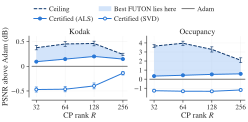
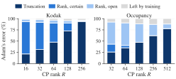
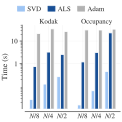

# Error bound of FUTON

How well can a FUTON of a given size fit a signal, before it is trained? For FUTON with a linear decoder the question has an exact answer, computed from the signal's samples before any training, and the answer comes with a model: a FUTON that fits the signal at least as well as promised, built without training.

## In short

FUTON's error splits exactly into two parts, as the sides of a right triangle do:

$$
\lVert \boldsymbol{s} - \boldsymbol{s}^{\text{futon}} \rVert^2 = \underbrace{\lVert \boldsymbol{s} - \hat{\boldsymbol{s}}_K \rVert^2}_{\text{truncation}} + \underbrace{\lVert \boldsymbol{\mathcal{Z}} - \boldsymbol{\mathcal{Y}} \rVert_F^2}_{\text{CP misfit}} .
$$

The *truncation* is what the basis cannot express at spectral resolution $K$: the error of the best approximation $\hat{\boldsymbol{s}}_K$ of the signal by the basis, which no rank lowers. The *CP misfit* is what rank $R$ cannot express of the rest: the distance between the signal's coefficient tensor $\boldsymbol{\mathcal{Z}}$ and the model's, $\boldsymbol{\mathcal{Y}}$, whose CP rank is at most $R$. Training changes only the second part, and its best value is the best rank-$R$ approximation error of $\boldsymbol{\mathcal{Z}}$.

The truncation is computed exactly. The best CP misfit is bracketed: from below by the singular values of the coefficient tensor flattened into matrices, and from above by an explicit rank-$R$ tensor built by nested SVDs, whose FUTON has exactly that error. In PSNR, every spectral resolution $K$ and rank $R$ thus get three numbers:

| PSNR | What it guarantees |
| --- | --- |
| Truncation | no FUTON of resolution $K$ exceeds it, at any rank |
| Ceiling | no FUTON of resolution $K$ and rank $R$ exceeds it |
| Certified | the *certified FUTON*, built from the samples without training, reaches it exactly |

The best FUTON of that size lies between the certified PSNR and the ceiling. <!-- summary -->On the benchmark's Kodak images and occupancy volumes, no trained FUTON passes its ceiling, in any of 348 settings, and the certified FUTON matches or beats Adam's in 99 % of them.<!-- /summary --> `nf.futon_bound` computes all three numbers and the certified FUTON from a sampled signal.

## Setting

Equations and definitions are numbered as in the paper.

**Signal and norm.** A signal $\boldsymbol{s}$ maps a product domain $\mathbb{X} = \mathbb{X}_1 \times \cdots \times \mathbb{X}_C$ to $\mathbb{R}^D$, and is measured by

$$
\lVert \boldsymbol{f} \rVert^2 = \sum_{d=1}^{D} \int_{\mathbb{X}} f_d^2 \, d\mu , \qquad \mu = \mu_1 \otimes \cdots \otimes \mu_C ,
$$

with the matching inner product $\langle \cdot, \cdot \rangle$. Two cases matter. On the unit cube with the Lebesgue measure, this is the paper's $L^2([0,1]^C)$. On a sampling grid, $N_c$ points on axis $c$ with $\mu_c$ uniform on them, $\lVert \boldsymbol{f} \rVert^2$ is $D$ times the mean squared error over the $N = \prod_c N_c$ points, the error FUTON is trained and evaluated on. Everything below holds in both cases; in the second, it is computed from the samples.

**Basis.** Axis $c$ uses $K_c$ functions, collected in $\boldsymbol{\varphi}(x_c) \in \mathbb{R}^{K_c}$. They need not be orthonormal: the paper's cosine basis is orthonormal on $[0, 1]$, the sinc and Lanczos bases of the benchmarks are not. The products $\phi_{\boldsymbol{k}}(\boldsymbol{x}) = \prod_c \varphi_{k_c}(x_c)$ span the space $\mathbb{V}_K$ of what the basis can express at resolution $K = (K_1, \dots, K_C)$, and $\hat{\boldsymbol{s}}_K$ is the orthogonal projection of $\boldsymbol{s}$ onto it, channel by channel: the best approximation of the signal in $\mathbb{V}_K$, which for an orthonormal basis is the partial sum of its generalized Fourier series (Eq. 4).

**Coefficients.** The theorem reads the signal through its coefficients in an orthonormal basis of $\mathbb{V}_K$, which one factorization per axis provides. The Gram matrix of axis $c$ factors as

$$
\boldsymbol{G}_c = \int_{\mathbb{X}_c} \boldsymbol{\varphi}(x_c) \, \boldsymbol{\varphi}(x_c)^\top d\mu_c = \boldsymbol{B}_c^\top \boldsymbol{B}_c , \qquad \boldsymbol{B}_c \in \mathbb{R}^{K'_c \times K_c}, \quad K'_c = \operatorname{rank} \boldsymbol{G}_c ,
$$

with $\boldsymbol{B}_c$ of full row rank, so that $\boldsymbol{B}_c \boldsymbol{B}_c^{+} = \boldsymbol{I}$ for its pseudoinverse. Then $\boldsymbol{\psi}(x_c) = (\boldsymbol{B}_c^{+})^\top \boldsymbol{\varphi}(x_c) \in \mathbb{R}^{K'_c}$ is an orthonormal basis of the same span (Lemma 1), and the signal's coefficients in the products of these functions form the *coefficient tensor*

$$
\boldsymbol{\mathcal{Z}} \in \mathbb{R}^{K'_1 \times \cdots \times K'_C \times D}, \qquad z_{\boldsymbol{j} d} = \Big\langle s_d , \prod_{c=1}^{C} \psi_{j_c}(x_c) \Big\rangle .
$$

For an orthonormal basis, $\boldsymbol{B}_c = \boldsymbol{I}$ and $\boldsymbol{\mathcal{Z}}$ holds the generalized Fourier coefficients of Eq. (4).

**Model.** FUTON with a linear decoder (Eqs. 9 to 11) is

$$
\boldsymbol{s}^{\text{futon}}_{\boldsymbol{\theta}}(\boldsymbol{x}) = \boldsymbol{V} \big( \boldsymbol{U}^{(1)\top} \boldsymbol{\varphi}(x_1) \odot \cdots \odot \boldsymbol{U}^{(C)\top} \boldsymbol{\varphi}(x_C) \big),
$$

with parameters $\boldsymbol{\theta} = (\boldsymbol{U}^{(1)}, \dots, \boldsymbol{U}^{(C)}, \boldsymbol{V})$, $\boldsymbol{U}^{(c)} \in \mathbb{R}^{K_c \times R}$ and $\boldsymbol{V} \in \mathbb{R}^{D \times R}$, and no bias or output activation. Its weights form the CP tensor

$$
[\![ \boldsymbol{U}^{(1)}, \dots, \boldsymbol{U}^{(C)}, \boldsymbol{V} ]\!] = \sum_{r=1}^{R} \boldsymbol{u}^{(1)}_r \otimes \cdots \otimes \boldsymbol{u}^{(C)}_r \otimes \boldsymbol{v}_r \in \mathbb{R}^{K_1 \times \cdots \times K_C \times D}
$$

of rank at most $R$, whose last factor is the decoder.

**Rank-$R$ error.** For a tensor $\boldsymbol{\mathcal{Z}}$, $\varepsilon_R(\boldsymbol{\mathcal{Z}}) = \inf \{ \lVert \boldsymbol{\mathcal{Z}} - \boldsymbol{\mathcal{Y}} \rVert_F : \operatorname{rank} \boldsymbol{\mathcal{Y}} \le R \}$ is the error of its best rank-$R$ CP approximation (rank as in Definition 17). For a nonempty proper subset $\mathbb{S}$ of its modes, $\boldsymbol{\mathcal{Z}}_{\langle \mathbb{S} \rangle}$ is the matrix that flattens it with the modes in $\mathbb{S}$ as rows and the others as columns (Definition 11 for one mode), and $\sigma_1 \ge \sigma_2 \ge \cdots$ are its singular values.

## Theorem

> **Theorem (Error of FUTON with a linear decoder).** Let $\boldsymbol{s}$ be square-integrable, $K = (K_1, \dots, K_C)$ and $R \ge 1$.
>
> **(1) Every FUTON.** For every $\boldsymbol{\theta}$,
>
> $$
> \big\lVert \boldsymbol{s} - \boldsymbol{s}^{\text{futon}}_{\boldsymbol{\theta}} \big\rVert^2 = \underbrace{\lVert \boldsymbol{s} - \hat{\boldsymbol{s}}_K \rVert^2}_{\text{truncation}} + \underbrace{\big\lVert \boldsymbol{\mathcal{Z}} - [\![ \boldsymbol{B}_1 \boldsymbol{U}^{(1)}, \dots, \boldsymbol{B}_C \boldsymbol{U}^{(C)}, \boldsymbol{V} ]\!] \big\rVert_F^2}_{\text{CP misfit}},
> $$
>
> and the truncation is $\lVert \boldsymbol{s} - \hat{\boldsymbol{s}}_K \rVert^2 = \lVert \boldsymbol{s} \rVert^2 - \lVert \boldsymbol{\mathcal{Z}} \rVert_F^2$.
>
> **(2) The best FUTON.**
>
> $$
> \inf_{\boldsymbol{\theta}} \big\lVert \boldsymbol{s} - \boldsymbol{s}^{\text{futon}}_{\boldsymbol{\theta}} \big\rVert^2 = \lVert \boldsymbol{s} - \hat{\boldsymbol{s}}_K \rVert^2 + \varepsilon_R(\boldsymbol{\mathcal{Z}})^2 .
> $$
>
> **(3) Computable bounds.** $L_R \le \varepsilon_R(\boldsymbol{\mathcal{Z}}) \le U_R$, where
>
> $$
> L_R^2 = \max_{\mathbb{S}} \sum_{i > R} \sigma_i^2\big(\boldsymbol{\mathcal{Z}}_{\langle \mathbb{S} \rangle}\big), \qquad U_R^2 = \lVert \boldsymbol{\mathcal{Z}} \rVert_F^2 - \sum_{\ell = 1}^{R} w_{(\ell)}^2 ,
> $$
>
> and $w_{(1)} \ge w_{(2)} \ge \cdots$ are the sorted weights of an orthonormal rank-1 expansion $\boldsymbol{\mathcal{Z}} = \sum_\ell w_\ell \boldsymbol{\mathcal{T}}_\ell$ by nested SVDs (Lemma 3). The upper bound comes with its model: if $[\![ \tilde{\boldsymbol{U}}^{(1)}, \dots, \tilde{\boldsymbol{U}}^{(C)}, \tilde{\boldsymbol{V}} ]\!]$ is the sum of the $R$ heaviest terms, the FUTON with $\hat{\boldsymbol{U}}^{(c)} = \boldsymbol{B}_c^{+} \tilde{\boldsymbol{U}}^{(c)}$ and $\hat{\boldsymbol{V}} = \tilde{\boldsymbol{V}}$ has squared error exactly $\lVert \boldsymbol{s} - \hat{\boldsymbol{s}}_K \rVert^2 + U_R^2$. Any other tensor of rank at most $R$ in place of those terms gives a FUTON in the same way, and its misfit is an upper bound too.
>
> **(4) When the bounds meet.** If at most two modes of $\boldsymbol{\mathcal{Z}}$ have more than one entry, as for $C = 1$, or for $C = 2$ and $D = 1$, then $L_R = \varepsilon_R(\boldsymbol{\mathcal{Z}}) = U_R$ and the infimum in (2) is attained. With three or more such modes, as for $C \ge 3$, or for $C = 2$ and $D \ge 2$, it need not be attained.
>
> All these quantities depend on the basis only through the span of $\boldsymbol{\varphi}$ on each axis.

For an orthonormal basis, $\boldsymbol{B}_c = \boldsymbol{I}$ and $\boldsymbol{\mathcal{Z}}$ holds the generalized Fourier coefficients, so item (2) reads: the best FUTON misses the signal by the truncation of its generalized Fourier series plus the best rank-$R$ CP approximation error of its coefficients. The theorem extends this to any basis, states it for every $\boldsymbol{\theta}$, and brackets the CP part where its exact value is out of reach.

**Truncation, ceiling and certified FUTON.** A signal in $[-1, 1]$ fitted on its grid with squared error $e$ has $\mathrm{PSNR} = 10 \log_{10}(4D / e)$, and the theorem gives three PSNRs at each $(K, R)$:

- the *truncation*, with $e = \lVert \boldsymbol{s} - \hat{\boldsymbol{s}}_K \rVert^2$, which no FUTON of resolution $K$ exceeds, at any rank;
- the *ceiling*, with $e = \lVert \boldsymbol{s} - \hat{\boldsymbol{s}}_K \rVert^2 + L_R^2$, which no FUTON of resolution $K$ and rank $R$ exceeds. It is a value, not a model, and a FUTON reaches it only in the case of item (4);
- the *certified PSNR*, with $e = \lVert \boldsymbol{s} - \hat{\boldsymbol{s}}_K \rVert^2 + U_R^2$, the exact PSNR of the *certified FUTON* $\hat{\boldsymbol{\theta}}$ of item (3), built from the samples without training. It comes in two forms, named for how they are computed: the *SVD form* takes the $R$ heaviest terms of the nested-SVD expansion (`sweeps=0`), and the *ALS form*, the default, refines them by alternating least squares (Algorithm), which never lowers the PSNR.

The best PSNR a FUTON of resolution $K$ and rank $R$ can reach lies between the certified PSNR and the ceiling.

> **Corollary (design).** A target PSNR $\tau$ is out of reach at $(K, R)$ if the ceiling is below $\tau$, and the certified FUTON reaches it if the certified PSNR is at least $\tau$. The smallest $(K, R)$ of the second kind is therefore a design for $\tau$ that comes with its model, and no $(K, R)$ of the first kind can be one.

## Consequences

> **Proposition (separation rank).** If $\boldsymbol{s}$ is within $\delta$ of a sum of $R$ separable terms, $\lVert \boldsymbol{s} - \sum_{r=1}^{R} g^{(1)}_r(x_1) \cdots g^{(C)}_r(x_C) \, \boldsymbol{v}_r \rVert \le \delta$ with any $g^{(c)}_r \in L^2(\mathbb{X}_c, \mu_c)$ and $\boldsymbol{v}_r \in \mathbb{R}^D$, then the best FUTON of rank $R$ at resolution $K$ has squared error at most $\lVert \boldsymbol{s} - \hat{\boldsymbol{s}}_K \rVert^2 + \delta^2$, whatever the basis.

Fixing the basis thus costs nothing but the truncation: FUTON never needs more rank than the signal's separation rank at the same accuracy.

**Remark (why the bound depends on the signal).** No bound on the rank a signal needs can hold for all signals. The tensors of rank at most $R$ in $\mathbb{R}^{K'_1 \times \cdots \times K'_C \times D}$ lie in a closed algebraic set of dimension at most $R \, (\sum_c K'_c + D - C)$ (Landsberg, 2012), so wherever that is below $D \prod_c K'_c$, almost every coefficient tensor has a positive rank-$R$ error; almost every $K \times K \times K$ tensor has rank at least $\lceil K^3 / (3K - 2) \rceil$ (Lickteig, 1985), 21,903 at $K = 256$. The theorem therefore works with the signal at hand, and the proposition pays with an assumption on it.

**Remark (nonlinear decoders).** The benchmarks' FUTON adds a one-hidden-layer ReLU decoder and a $\tanh$ at the output, which the theorem does not cover. The upper bound transfers to the decoder: a ReLU layer of at least $2D$ units contains every linear decoder, since $\operatorname{relu}(x) - \operatorname{relu}(-x) = x$, so the best MLP-decoder FUTON at $(K, R)$ is at least as good as the certified linear one, with more parameters. The lower bound does not transfer: biases and a hidden layer fit what no linear decoder can. The $\tanh$ is 1-Lipschitz, so for a target $\boldsymbol{s} = \tanh(\tilde{\boldsymbol{s}})$, which on a grid is every target with $\lvert \boldsymbol{s} \rvert < 1$, the error of $\tanh \circ \boldsymbol{s}^{\text{futon}}$ against $\boldsymbol{s}$ is at most that of $\boldsymbol{s}^{\text{futon}}$ against $\tilde{\boldsymbol{s}}$, which the theorem bounds; a target that reaches $\pm 1$, as occupancy does, has no such $\tilde{\boldsymbol{s}}$.

## Proof

**Lemma 1 (Orthonormal basis of the span).** The entries of $\boldsymbol{\psi}(x_c)$ are orthonormal in $L^2(\mathbb{X}_c, \mu_c)$, and $\boldsymbol{\varphi}(x_c) = \boldsymbol{B}_c^\top \boldsymbol{\psi}(x_c)$ for $\mu_c$-almost every $x_c$. Hence they span the same space as $\boldsymbol{\varphi}$.

*Proof.* $\int \boldsymbol{\psi} \boldsymbol{\psi}^\top d\mu_c = (\boldsymbol{B}_c^{+})^\top \boldsymbol{B}_c^\top \boldsymbol{B}_c \boldsymbol{B}_c^{+} = (\boldsymbol{B}_c \boldsymbol{B}_c^{+})^\top (\boldsymbol{B}_c \boldsymbol{B}_c^{+}) = \boldsymbol{I}$. Let $\boldsymbol{P} = \boldsymbol{B}_c^{+} \boldsymbol{B}_c$, the orthogonal projector onto the row space of $\boldsymbol{B}_c$; then $\boldsymbol{B}_c^\top \boldsymbol{\psi} = \boldsymbol{P}^\top \boldsymbol{\varphi} = \boldsymbol{P} \boldsymbol{\varphi}$. Moreover $\int \lVert (\boldsymbol{I} - \boldsymbol{P}) \boldsymbol{\varphi} \rVert_2^2 \, d\mu_c = \operatorname{tr}\big((\boldsymbol{I} - \boldsymbol{P}) \boldsymbol{G}_c (\boldsymbol{I} - \boldsymbol{P})\big) = \lVert \boldsymbol{B}_c (\boldsymbol{I} - \boldsymbol{P}) \rVert_F^2 = 0$, because $\boldsymbol{B}_c \boldsymbol{P} = \boldsymbol{B}_c$. So $\boldsymbol{\varphi} = \boldsymbol{P} \boldsymbol{\varphi} = \boldsymbol{B}_c^\top \boldsymbol{\psi}$ almost everywhere, which puts the span of $\boldsymbol{\varphi}$ inside that of $\boldsymbol{\psi}$; the definition of $\boldsymbol{\psi}$ gives the converse. $\square$

By Fubini, $\langle \prod_c \psi_{j_c}, \prod_c \psi_{j'_c} \rangle = \prod_c \langle \psi_{j_c}, \psi_{j'_c} \rangle = \delta_{\boldsymbol{j} \boldsymbol{j}'}$, the orthonormality half of the paper's Theorem 1, and by Lemma 1 these products span $\mathbb{V}_K$; so they form an orthonormal basis of it. Write $\boldsymbol{\Phi}(\boldsymbol{x}) = \boldsymbol{\varphi}(x_1) \otimes \cdots \otimes \boldsymbol{\varphi}(x_C)$, $\boldsymbol{\Psi}(\boldsymbol{x}) = \boldsymbol{\psi}(x_1) \otimes \cdots \otimes \boldsymbol{\psi}(x_C)$, and $\bullet$ for the generalized dot product (Definition 1). Then $\hat{\boldsymbol{s}}_K = \boldsymbol{\Psi} \bullet \boldsymbol{\mathcal{Z}}$, and Parseval's identity reads $\lVert \boldsymbol{\Psi} \bullet \boldsymbol{\mathcal{A}} \rVert = \lVert \boldsymbol{\mathcal{A}} \rVert_F$ for every tensor $\boldsymbol{\mathcal{A}}$ of the size of $\boldsymbol{\mathcal{Z}}$.

**Lemma 2 (CP form under mode products).** $[\![ \boldsymbol{U}^{(1)}, \dots, \boldsymbol{U}^{(C)}, \boldsymbol{V} ]\!] \times_1 \boldsymbol{B}_1 \cdots \times_C \boldsymbol{B}_C = [\![ \boldsymbol{B}_1 \boldsymbol{U}^{(1)}, \dots, \boldsymbol{B}_C \boldsymbol{U}^{(C)}, \boldsymbol{V} ]\!]$.

*Proof.* By the paper's Definition 15, $(\boldsymbol{u}_1 \otimes \cdots \otimes \boldsymbol{u}_C \otimes \boldsymbol{v}) \times_c \boldsymbol{B}_c$ replaces $\boldsymbol{u}_c$ by $\boldsymbol{B}_c \boldsymbol{u}_c$, and the mode product is linear. $\square$

**Lemma 3 (Orthonormal rank-1 expansion).** For a tensor $\boldsymbol{\mathcal{Z}}$ of order $M \ge 2$ and any order of its modes, nested SVDs give $\boldsymbol{\mathcal{Z}} = \sum_\ell w_\ell \boldsymbol{\mathcal{T}}_\ell$ with $w_\ell \ge 0$, every $\boldsymbol{\mathcal{T}}_\ell$ of rank one, and $\langle \boldsymbol{\mathcal{T}}_\ell, \boldsymbol{\mathcal{T}}_{\ell'} \rangle = \delta_{\ell \ell'}$. For every set $\mathbb{L}$ of $R$ terms, $\sum_{\ell \in \mathbb{L}} w_\ell \boldsymbol{\mathcal{T}}_\ell$ has rank at most $R$ and $\lVert \boldsymbol{\mathcal{Z}} - \sum_{\ell \in \mathbb{L}} w_\ell \boldsymbol{\mathcal{T}}_\ell \rVert_F^2 = \lVert \boldsymbol{\mathcal{Z}} \rVert_F^2 - \sum_{\ell \in \mathbb{L}} w_\ell^2$.

*Proof.* By induction on $M$. For $M = 2$ the SVD is such an expansion. For $M > 2$, let the first mode in the order be $m$ and $\boldsymbol{Z}_{(m)} = \sum_i \sigma_i \boldsymbol{a}_i \boldsymbol{b}_i^\top$ be an SVD. Folding $\boldsymbol{b}_i$ into a tensor $\boldsymbol{\mathcal{Y}}_i$ of the other $M - 1$ modes gives $\boldsymbol{\mathcal{Z}} = \sum_i \sigma_i \, \boldsymbol{a}_i \otimes \boldsymbol{\mathcal{Y}}_i$ with $\langle \boldsymbol{\mathcal{Y}}_i, \boldsymbol{\mathcal{Y}}_j \rangle = \delta_{ij}$, the modes put back in place. By induction $\boldsymbol{\mathcal{Y}}_i = \sum_{\ell'} w'_{i \ell'} \boldsymbol{\mathcal{T}}'_{i \ell'}$, so $\boldsymbol{\mathcal{Z}} = \sum_{i, \ell'} \sigma_i w'_{i\ell'} \, \boldsymbol{a}_i \otimes \boldsymbol{\mathcal{T}}'_{i \ell'}$, a sum of rank-1 tensors with $\langle \boldsymbol{a}_i \otimes \boldsymbol{\mathcal{T}}'_{i \ell'}, \boldsymbol{a}_j \otimes \boldsymbol{\mathcal{T}}'_{j k'} \rangle = \langle \boldsymbol{a}_i, \boldsymbol{a}_j \rangle \langle \boldsymbol{\mathcal{T}}'_{i \ell'}, \boldsymbol{\mathcal{T}}'_{j k'} \rangle = \delta_{ij} \delta_{\ell' k'}$. The residual is the sum of the terms outside $\mathbb{L}$, whose squared norm is the sum of their squared weights by orthonormality. $\square$

**Proof of the theorem.** (1) Substituting the CP form (8) into Eq. (7), as the paper does to derive Eqs. (9) to (11), gives $\boldsymbol{s}^{\text{futon}}_{\boldsymbol{\theta}} = \boldsymbol{\Phi} \bullet \boldsymbol{\mathcal{W}}$ with $\boldsymbol{\mathcal{W}} = [\![ \boldsymbol{U}^{(1)}, \dots, \boldsymbol{U}^{(C)}, \boldsymbol{V} ]\!]$. By Lemma 1, $\boldsymbol{\Phi}(\boldsymbol{x}) = \bigotimes_c \boldsymbol{B}_c^\top \boldsymbol{\psi}(x_c)$ almost everywhere, so $\boldsymbol{\Phi} \bullet \boldsymbol{\mathcal{W}} = \boldsymbol{\Psi} \bullet \boldsymbol{\mathcal{Y}}_{\boldsymbol{\theta}}$ with $\boldsymbol{\mathcal{Y}}_{\boldsymbol{\theta}} = \boldsymbol{\mathcal{W}} \times_1 \boldsymbol{B}_1 \cdots \times_C \boldsymbol{B}_C = [\![ \boldsymbol{B}_1 \boldsymbol{U}^{(1)}, \dots, \boldsymbol{B}_C \boldsymbol{U}^{(C)}, \boldsymbol{V} ]\!]$ by Lemma 2. Then

$$
\boldsymbol{s} - \boldsymbol{s}^{\text{futon}}_{\boldsymbol{\theta}} = (\boldsymbol{s} - \hat{\boldsymbol{s}}_K) + \boldsymbol{\Psi} \bullet (\boldsymbol{\mathcal{Z}} - \boldsymbol{\mathcal{Y}}_{\boldsymbol{\theta}}),
$$

where the first term is orthogonal to $\mathbb{V}_K$ and the second lies in it. Pythagoras and Parseval give (1). The same argument with $\boldsymbol{\mathcal{Y}} = \boldsymbol{0}$ gives $\lVert \boldsymbol{s} \rVert^2 = \lVert \boldsymbol{s} - \hat{\boldsymbol{s}}_K \rVert^2 + \lVert \boldsymbol{\mathcal{Z}} \rVert_F^2$.

(2) The image of $\boldsymbol{\theta} \mapsto \boldsymbol{\mathcal{Y}}_{\boldsymbol{\theta}}$ is exactly the set of tensors of rank at most $R$. It lies inside, since Lemma 2 writes $\boldsymbol{\mathcal{Y}}_{\boldsymbol{\theta}}$ as a sum of $R$ rank-1 terms. It covers the set, since for $\boldsymbol{\mathcal{Y}} = [\![ \tilde{\boldsymbol{U}}^{(1)}, \dots, \tilde{\boldsymbol{U}}^{(C)}, \tilde{\boldsymbol{V}} ]\!]$ the parameters $\hat{\boldsymbol{\theta}} = (\boldsymbol{B}_1^{+} \tilde{\boldsymbol{U}}^{(1)}, \dots, \boldsymbol{B}_C^{+} \tilde{\boldsymbol{U}}^{(C)}, \tilde{\boldsymbol{V}})$ give $\boldsymbol{\mathcal{Y}}_{\hat{\boldsymbol{\theta}}} = \boldsymbol{\mathcal{Y}}$, because $\boldsymbol{B}_c \boldsymbol{B}_c^{+} = \boldsymbol{I}$. Taking the infimum of (1) over $\boldsymbol{\theta}$ is therefore taking it over that set.

(3) *Lower bound.* Each rank-1 term of a tensor $\boldsymbol{\mathcal{Y}}$ of rank at most $R$ flattens to a rank-1 matrix, so $\operatorname{rank} \boldsymbol{\mathcal{Y}}_{\langle \mathbb{S} \rangle} \le R$, as the paper's Eq. (27) shows for one mode. Flattening preserves the Frobenius norm, and by the Eckart–Young–Mirsky theorem $\lVert \boldsymbol{\mathcal{Z}} - \boldsymbol{\mathcal{Y}} \rVert_F^2 = \lVert \boldsymbol{\mathcal{Z}}_{\langle \mathbb{S} \rangle} - \boldsymbol{\mathcal{Y}}_{\langle \mathbb{S} \rangle} \rVert_F^2 \ge \sum_{i > R} \sigma_i^2(\boldsymbol{\mathcal{Z}}_{\langle \mathbb{S} \rangle})$ for every $\mathbb{S}$. *Upper bound.* By Lemma 3 the $R$ heaviest terms form a tensor of rank at most $R$ at squared distance $U_R^2$, which is $\boldsymbol{\mathcal{Y}}_{\hat{\boldsymbol{\theta}}}$ for the $\hat{\boldsymbol{\theta}}$ of (2); by (1) that FUTON's squared error is $\lVert \boldsymbol{s} - \hat{\boldsymbol{s}}_K \rVert^2 + U_R^2$. Any other tensor of rank at most $R$ works in the same way.

(4) If two modes have more than one entry, the tensors of rank at most $R$ are the matrices of rank at most $R$ in those modes, and the expansion of Lemma 3 along them is the SVD. Its $R$ heaviest terms are the truncated SVD, so $U_R = L_R$ is the Eckart–Young–Mirsky optimum, which is attained. With three or more such modes, the set of tensors of rank at most $R$ is not closed in general, and a best approximation need not exist (de Silva and Lim, *SIAM J. Matrix Anal. Appl.* 30(3), 2008).

The quantities depend on the basis only through its span: another orthonormal basis of the same span is $\boldsymbol{O} \boldsymbol{\psi}$ with $\boldsymbol{O}$ orthogonal, which rotates $\boldsymbol{\mathcal{Z}}$ mode by mode and changes no norm, no singular value and no weight of the nested SVDs. $\blacksquare$

**Proof of the proposition.** $\mathbb{V}_K$ is the span of products of one function per axis from the axis spans, so its projection factorizes over the axes, $P_K = P_{K_1} \otimes \cdots \otimes P_{K_C}$, and $P_K$ of a separable term is the separable term of the projected factors. Hence $P_K \sum_r g^{(1)}_r \cdots g^{(C)}_r \boldsymbol{v}_r = \boldsymbol{\Psi} \bullet \boldsymbol{\mathcal{Y}}$ with $\boldsymbol{\mathcal{Y}}$ a sum of $R$ rank-1 tensors, and by item (1) the FUTON with that $\boldsymbol{\mathcal{Y}}$ has squared error $\lVert \boldsymbol{s} - \hat{\boldsymbol{s}}_K \rVert^2 + \lVert \boldsymbol{\mathcal{Z}} - \boldsymbol{\mathcal{Y}} \rVert_F^2$, where $\lVert \boldsymbol{\mathcal{Z}} - \boldsymbol{\mathcal{Y}} \rVert_F = \lVert P_K (\boldsymbol{s} - \sum_r g^{(1)}_r \cdots g^{(C)}_r \boldsymbol{v}_r) \rVert \le \delta$, a projection being nonexpansive. $\square$

**Remark (refinement).** Item (3) holds for any tensor of rank at most $R$, so the SVD form can be improved by any search whose result is taken exactly: the ALS form refines it by alternating least squares, whose every sweep solves each factor's least-squares problem exactly and so never increases $\lVert \boldsymbol{\mathcal{Z}} - \boldsymbol{\mathcal{Y}} \rVert_F$. Every iterate is a valid, tighter $U_R$ and, by (2), again a FUTON. A smaller rank's factors, padded with zero components, are factors of every larger rank, so $U_R$ is also taken nonincreasing in $R$.

**Remark (colour channels).** For RGB images, $C = 2$ and $D = 3$, so $\boldsymbol{\mathcal{Z}}$ is of order three and item (4) does not apply. The decoder $\boldsymbol{V}$ is the factor of the colour mode. Expanding that mode first in Lemma 3 is a principal component analysis of the colours, followed by one SVD per colour component and a common rank budget across them.

## Algorithm

On the sampling grid, axis $c$'s basis is the matrix $\boldsymbol{\Phi}_c \in \mathbb{R}^{N_c \times K_c}$ with rows $\boldsymbol{\varphi}(x_{c,n})^\top$, and the signal is the array $\boldsymbol{\mathcal{S}} \in \mathbb{R}^{N_1 \times \cdots \times N_C \times D}$ of its samples. A thin SVD $\boldsymbol{\Phi}_c / \sqrt{N_c} = \boldsymbol{Q}_c \boldsymbol{\Sigma}_c \boldsymbol{P}_c^\top$, truncated at the numerical rank $K'_c$, gives $\boldsymbol{B}_c = \boldsymbol{\Sigma}_c \boldsymbol{P}_c^\top$, $\boldsymbol{B}_c^{+} = \boldsymbol{P}_c \boldsymbol{\Sigma}_c^{-1}$ and $\boldsymbol{\psi}(x_{c,n}) = \sqrt{N_c} \, [\boldsymbol{Q}_c]_{n,:}$.

| Step | Computes | Cost |
| --- | --- | --- |
| 1 | $\boldsymbol{Q}_c, \boldsymbol{\Sigma}_c, \boldsymbol{P}_c$ from the thin SVD of $\boldsymbol{\Phi}_c / \sqrt{N_c}$ | $O(N_c K_c^2)$ per axis |
| 2 | $\boldsymbol{\mathcal{Z}} = \boldsymbol{\mathcal{S}} \times_1 \boldsymbol{Q}_1^\top \cdots \times_C \boldsymbol{Q}_C^\top / \sqrt{N}$ | $O(N D \sum_c K_c)$ |
| 3 | $\lVert \boldsymbol{s} - \hat{\boldsymbol{s}}_K \rVert^2 = \lVert \boldsymbol{\mathcal{S}} \rVert_F^2 / N - \lVert \boldsymbol{\mathcal{Z}} \rVert_F^2$, exact | $O(N D)$ |
| 4 | $L_R^2$: singular values of every flattening of $\boldsymbol{\mathcal{Z}}$, tails beyond each $R$ | one eigendecomposition per split |
| 5 | Lemma 3 for every mode order, keeping the order with the most weight in its $R$ heaviest terms: the SVD form | nested SVDs of $\boldsymbol{\mathcal{Z}}$ |
| 6 | Refine those terms by alternating least squares (below): the ALS form; $U_R^2 = \lVert \boldsymbol{\mathcal{Z}} - \boldsymbol{\mathcal{Y}} \rVert_F^2$ in float64 | $O(T R D \prod_c K'_c)$ for $T$ sweeps |
| 7 | $\hat{\boldsymbol{U}}^{(c)} = \boldsymbol{P}_c \boldsymbol{\Sigma}_c^{-1} \tilde{\boldsymbol{U}}^{(c)}$, $\hat{\boldsymbol{V}} = \tilde{\boldsymbol{V}}$ | $O(R \sum_c K_c K'_c)$ |

**Alternating least squares.** Step 6 starts from the SVD form and minimizes the CP misfit $\lVert \boldsymbol{\mathcal{Z}} - [\![ \boldsymbol{A}_1, \dots, \boldsymbol{A}_{C+1} ]\!] \rVert_F^2$ over the factors $\boldsymbol{A}_m \in \mathbb{R}^{K'_m \times R}$ of the coefficient tensor's $C + 1$ modes: $\boldsymbol{A}_c = \tilde{\boldsymbol{U}}^{(c)}$ for the axes and $\boldsymbol{A}_{C+1} = \tilde{\boldsymbol{V}}$, with $K'_{C+1} = D$, for the channels. A sweep visits the modes in turn and replaces each factor by the exact least-squares solution with the others held fixed,

$$
\boldsymbol{A}_m \leftarrow \boldsymbol{\mathcal{Z}}_{(m)} \boldsymbol{K}_m \Big( \bigodot_{k \ne m} \boldsymbol{A}_k^\top \boldsymbol{A}_k \Big)^{-1},
$$

where $\boldsymbol{\mathcal{Z}}_{(m)}$ is the mode-$m$ matricization, $\boldsymbol{K}_m$ the Khatri–Rao product of the other factors in the matching order, and $\odot$ the elementwise product of their $R \times R$ Gram matrices; the system is solved with a ridge of $10^{-12}$ of its mean diagonal. Each update is an exact block minimization, so a sweep never raises the misfit. After a sweep, each component's scale is spread evenly over the modes, which leaves the tensor unchanged, and the sweep's step is continued past the new factors by $k^{1/3}$ times its length at sweep $k$, kept if that lowers the misfit (Bro, 1998). The sweeps stop once one lowers the bound, truncation plus misfit, by less than $\mathrm{tol} = 3 \cdot 10^{-5}$ of it, or after 500. They work on the coefficient tensor, not on the samples, so a sweep costs $O(R D \prod_c K'_c)$ whatever the number of samples; they run in float32 on the signal's device, and $U_R$ is the misfit of the final factors in float64, valid whatever the search found. Each rank is refined on its own, and `sweeps=0` skips the step and returns the SVD form.

Dividing by $D$ turns the outputs into mean squared errors: every FUTON has an error of at least $(\lVert \boldsymbol{s} - \hat{\boldsymbol{s}}_K \rVert^2 + L_R^2)/D$, and the certified FUTON $\hat{\boldsymbol{\theta}}$ has exactly $(\lVert \boldsymbol{s} - \hat{\boldsymbol{s}}_K \rVert^2 + U_R^2)/D$. Everything a bound rests on, steps 1 to 5 and the misfit of step 6, is computed in float64. Step 2 is the only pass over the signal, and it is separable, one matrix product per axis. The rest works on the coefficient tensor, whose size is set by $K$, not by the signal, which is what makes the bound cheap next to training: Adam's every step passes over a batch of the signal, through the whole model, for thousands of steps.

```python
import torch
import neurofield as nf

data = nf.ImageCoordinateDataset("data/Kodak/kodim19.png")
H, W, _ = data.target.shape
model = nf.FUTON(2, 3, ("sinc", {"num_components": [H // 2, W // 2]}),
                 ("cp", {"rank": 64}), ("linear", {"bias": False}))
features = [model.basis.axis_features(torch.linspace(-1, 1, n), c)
            for c, n in enumerate((H, W))]
bound = nf.futon_bound(data.target, features, ranks=[32, 64, 256])
bound.truncation, bound.lower, bound.upper   # mean squared errors
bound.initialize(model)                      # the certified FUTON, error bound.upper[1]
```

## Experiment

The experiment asks three things of the bound: that it holds, that it is tight enough to stand in for training, and that it costs little enough to be worth computing first. Every number below is a dataset's: a mean, a count or a quantile over its signals.

**Setup.** The 24 Kodak images ($C = 2$, $D = 3$, $768 \times 512$ or $512 \times 768$ pixels in $[-1, 1]$) and the five Stanford occupancy volumes of the benchmark ($C = 3$, $D = 1$, occupancy $\pm 1$ on grids of 78 to 231 voxels per side), in the benchmark's sinc basis at $K_c = \alpha N_c$ for $\alpha \in \{1/8, 1/4, 1/2\}$, with $R \in \{32, 64, 128, 256\}$: 348 settings, and for the cost alone also at $K = N$. For each, `nf.futon_bound` gives the truncation, the ceiling and the certified FUTON $\hat{\boldsymbol{\theta}}$ in its ALS form, and times its SVD form; the same FUTON is trained with Adam under the benchmark's protocol: 2000 epochs on 10 % of the points per step for images and 1 % for volumes, learning rate $3 \cdot 10^{-2}$ annealed to a hundredth, one seed. Errors are mean squared errors on the whole grid, and PSNR is $10 \log_{10}(4 / \mathrm{MSE})$ for signals in $[-1, 1]$. Everything ran on one NVIDIA A100, the bound and Adam in the same job, so they are timed alike; `python scripts/futon_bound.py` reproduces it, and `python scripts/report_paper.py --tasks bound` writes the figures and tables to `results/bound/`.

**The bounds hold.** No trained FUTON passes its ceiling, in any of the 348 settings: none has an error below the lower bound. Every certified FUTON, evaluated by its own forward pass in float32, has the error of its upper bound to within a relative $3 \cdot 10^{-7}$. The tests check the same identities in float64 to $10^{-9}$, as well as the Eckart–Young case, the invariance within a span and a DCT cross-check.

**Images: the best FUTON is pinned down.** For an image's coefficient tensor, of order three, the interval that holds the best PSNR has a median width of 0.09 dB over the images and settings, and 90 % of the intervals are narrower than 0.34 dB. It widens with $K$, to a median of 0.01, 0.08 and 0.19 dB at $N/8$, $N/4$ and $N/2$, and closes as $R$ reaches the truncation. Adam's FUTON lies at or below the certified one in 98 % of the image settings, by 0.07 dB on average and up to 0.44 dB; where it is ahead, it is by at most 0.01 dB.

**Volumes: the upper bound is the certificate.** With three axes, every flattening of the coefficient tensor has rank at most the largest $K_c$, so once $R$ passes it the lower bound falls back to the truncation, although the CP misfit itself need not vanish: the interval has a median width of 0.86 dB at $N/4$ and 3.11 dB at $N/2$, while at $N/8$ the truncation alone caps the volumes at 17.9 dB on average, which the certified FUTON reaches to within 0.01 dB from $R = 128$ on. The certified FUTON beats Adam's in every setting, by 0.27 dB on average and up to 0.70 dB.

<figure markdown="span">
  { width="620" }
  <figcaption>PSNR above Adam's at K = N/2, averaged over the 24 Kodak images (left) and the five occupancy volumes (right), per rank, with one standard error of the difference: the ceiling; the certified FUTON in its ALS form (filled) and its SVD form (open); and, shaded between the ALS form and the ceiling, the region where the best FUTON lies.</figcaption>
</figure>

**Where Adam's error goes.** The theorem splits every FUTON's error into the truncation and the CP misfit, and the bounds split the misfit further: up to the ceiling it is forced by $R$, from the ceiling to the certified FUTON it is open, and beyond the certified FUTON it is left by training. As shares of Adam's error at $K = N/2$, the truncation is 31 % at $R = 32$ and 94 % at $R = 256$ on Kodak, the part that $R$ forces falls from 60 % to 1 %, at most 6 % stays open, and training leaves 2 to 4 %. On the volumes the truncation is 26 % to 62 %, the open part reaches 50 %, since the lower bound falls to the truncation there, and training leaves 8 to 13 %.

<figure markdown="span">
  { width="620" }
  <figcaption>Adam's error at K = N/2, in percent, as the theorem splits it, averaged over the 24 Kodak images (left) and the five occupancy volumes (right), per rank: the truncation, which K forces; the part of the CP misfit up to the ceiling, which R forces; the part from the ceiling to the certified FUTON, which the bound leaves open; and the rest, which training leaves.</figcaption>
</figure>

**Is training the limit?** On every signal at $K = N/2$, at $R = 64$ on Kodak and $R = 128$ on the volumes, Adam for five times the epochs and alternating least squares on the whole grid (`nf.LeastSquares` without momentum, from a random start), against the certified FUTON in its ALS form and the ceiling; means over each dataset, ± one within-signal standard error:

| Dataset | R | Certified (ALS) | Ceiling | Adam, 2000 epochs | Adam, 10,000 epochs | ALS, random start, 500 sweeps | ALS, random start, 2000 sweeps |
| --- | ---: | ---: | ---: | ---: | ---: | ---: | ---: |
| Kodak | 64 | 26.96 ± 0.00 | 27.26 ± 0.04 | 26.81 ± 0.02 | 26.92 ± 0.01 | 26.94 ± 0.01 | 26.96 ± 0.01 |
| Occupancy | 128 | 21.49 ± 0.06 | 24.25 ± 0.26 | 20.96 ± 0.06 | 21.39 ± 0.05 | 21.45 ± 0.05 | 21.57 ± 0.06 |

Five times the epochs raise Adam's mean from 26.81 to 26.92 dB on Kodak and from 20.96 to 21.39 dB on the volumes, against certified means of 26.96 and 21.49 dB. Least squares on the whole grid, from a random start, reaches 26.94 and 26.96 dB on Kodak and 21.45 and 21.57 dB on the volumes after 500 and 2000 sweeps. The better of the two passes the certified FUTON on 10 of the 24 images, by at most 0.06 dB, and on all five volumes, by at most 0.14 dB, inside the interval, as item (3) allows. None comes near the ceiling on the volumes, 2.7 dB above the best of them, where the lower bound is loose.

**Design: $K$ and $R$ for a target PSNR.** The corollary turns the bound into a design rule: among the candidate settings, take the smallest, by parameter count, whose certified PSNR reaches the target. The table compares that pick, per signal, with an oracle that trains every setting and takes the smallest that Adam reaches, and counts over each dataset. *Reached* counts the signals for which some setting reaches the target, by Adam, by the bound and by the ceiling; the next columns say how often the bound's pick has the same, a smaller or a larger parameter count than the oracle's, over the signals both reach, and the last the median parameter count of each pick.

| Dataset | Target (dB) | Reached by Adam, the bound, the ceiling | Same pick | Smaller | Larger | #Params, bound (k) | #Params, Adam (k) |
| --- | ---: | ---: | ---: | ---: | ---: | ---: | ---: |
| Kodak | 22 | 24/24, 24/24, 24/24 | 96% | 4% | 0% | 5.2 | 5.2 |
|  | 24 | 23/24, 23/24, 23/24 | 96% | 4% | 0% | 5.2 | 5.2 |
|  | 26 | 22/24, 22/24, 22/24 | 100% | 0% | 0% | 20.7 | 20.7 |
|  | 28 | 17/24, 18/24, 18/24 | 88% | 12% | 0% | 41.2 | 41.2 |
|  | 30 | 13/24, 13/24, 13/24 | 85% | 15% | 0% | 82.3 | 82.3 |
| Occupancy | 19 | 5/5, 5/5, 5/5 | 100% | 0% | 0% | 7.0 | 7.0 |
|  | 20 | 5/5, 5/5, 5/5 | 80% | 20% | 0% | 7.7 | 14.1 |
|  | 21 | 4/5, 4/5, 5/5 | 100% | 0% | 0% | 22.0 | 22.0 |
|  | 22 | 3/5, 3/5, 4/5 | 67% | 33% | 0% | 31.2 | 56.8 |
|  | 23 | 2/5, 3/5, 4/5 | 100% | 0% | 0% | 56.8 | 50.4 |

The bound's pick is never larger than the oracle's, and it is smaller for some signals (4, 4, 12 and 15 % of the images at 22, 24, 28 and 30 dB; 20 and 33 % of the volumes at 20 and 22 dB), and it comes with its model; it certifies 28 dB on 18 of the 24 images, where Adam reaches it on 17, and 23 dB on 3 of the 5 volumes, where Adam reaches it on 2. Read along a budget instead, the certified mean ranks the spectral resolutions as Adam's results do at every parameter count: on Kodak, $N/8$ is best up to about 5k parameters, $N/4$ from about 10k to 21k, and $N/2$ from about 41k; on the volumes, $N/8$ is best up to about 2k parameters, $N/4$ from about 4k to 16k, and $N/2$ from about 31k. Either way, the $(K, R)$ split is settled before anything is trained.

**Cost.** On the A100, the bound for all four ranks of a $K$ takes 0.6 to 5 s per image and 1 to 24 s per volume on average, up to 96 s on one volume at $N/2$, where one Adam run takes 4 to 11 s and 5 to 9 s. Over every setting of a signal, the design above costs 5 s per image against 64 s of training, and 28 s per volume against 73 s: 3 to 12 times less, with the model that reaches the target included.

**The SVD form.** The refinement is what costs. The certified FUTON in its SVD form, `sweeps=0`, takes 0.03 to 5 s per image and 0.08 to 6 s per volume for all four ranks, 34 % and 25 % of one Adam run per rank, and certifies a median 0.33 dB below the ALS form on images (at most 4.03 dB) and 1.54 dB below on volumes (at most 2.56 dB). It is a valid certificate at once; the ALS form is the tighter one.

| Dataset | $K$ | SVD (s) | ALS (s) | Adam (s) | SVD, dB below ALS: median | max |
| --- | ---: | ---: | ---: | ---: | ---: | ---: |
| Kodak | N/8 | 0.03 | 0.6 | 17 | 0.03 | 1.02 |
|  | N/4 | 5.48 | 2.6 | 24 | 0.16 | 1.27 |
|  | N/2 | 0.26 | 2.2 | 23 | 0.44 | 1.50 |
|  | N | 1.20 | 5.1 | 27 | 0.99 | 4.03 |
| Occupancy | N/8 | 0.20 | 1.2 | 23 | 0.19 | 1.47 |
|  | N/4 | 0.08 | 3.0 | 25 | 1.29 | 1.99 |
|  | N/2 | 3.53 | 23.6 | 25 | 1.69 | 2.27 |
|  | N | 5.50 | 13.2 | 28 | 1.93 | 2.56 |

<figure markdown="span">
  { width="300" }
  <figcaption>Seconds per signal for the four ranks of each spectral resolution, from N/8 to N, averaged over each dataset: the bound with the certified FUTON in its SVD form and in its ALS form, and the four Adam runs.</figcaption>
</figure>

## Related results

The ingredients are classical; the use is in combining them for this model, where every quantity can be computed from the signal and the bound is attained. For a matrix, the best rank-$R$ approximation and its error are the truncated SVD's (Eckart and Young, 1936; Mirsky, 1960), which is item (4). For a tensor of order three or more, a best rank-$R$ CP approximation need not exist (de Silva and Lim, 2008), which is why item (2) is an infimum and items (3) bracket it. The lower bound is the tail of a matricization, the quantity that bounds the truncation error of the HOSVD (De Lathauwer, De Moor and Vandewalle, 2000) and of the TT-SVD (Oseledets, 2011) from below; the nested SVDs of Lemma 3 are the TT-SVD taken to full rank, with a greedy choice of its heaviest terms in place of a truncation, which for two modes is the Kronecker-product SVD of Van Loan and Pitsianis (1993). The separation rank of a function and its $\varepsilon$-rank are the notions of the separated representations of Beylkin and Mohlenkamp (2002, 2005), fitted by alternating least squares; the proposition above says that a fixed basis inherits them up to the truncation. Learning with CP-structured Fourier coefficients appears in Kargas and Sidiropoulos (2021), with error bounds under smoothness, and with random Fourier features in Wesel and Batselier (2021); their analyses hold in expectation or asymptotically, where the theorem here is an identity for the signal at hand. For MLP-based neural fields, the structure of what a network can represent is known (Yüce, Ortiz-Jiménez, Dimitriadis and Frossard, 2022), but no analogue of item (2), the exact error of the best model at a given size, is available.

## Limitations

The theorem needs the signal on its whole grid, since the coefficient tensor is a sum over every sample: it covers representation, not radiance fields or inverse problems, where the signal is observed through a renderer or an operator, and its grid norm says nothing about points off the grid. It covers the paper's model, a linear decoder without bias or output activation; the remark above says what transfers to the benchmarks' decoders, and the lower bound does not. For three or more axes the lower bound falls to the truncation once $R$ passes the largest $K_c$, so the bracket is wide there and only the certified error is informative; a tighter lower bound for that regime is open, as is how far the certified error is from the infimum. The design corollary chooses among the candidate settings it is given; a finer grid of $K$ and $R$ costs one bound each.
