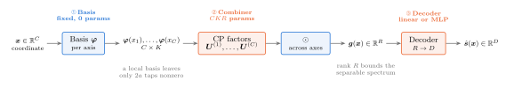
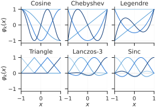
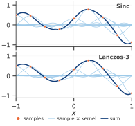
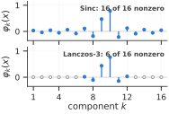

# FUTON

FUTON, the Fourier Tensor Network, represents a signal as a truncated series in a fixed basis whose coefficient tensor is kept in low-rank form. This page derives the model, describes each stage as it is implemented, and explains how to size one.

## From a series to a network

Take a signal $s : [-1, 1]^C \to \mathbb{R}$ and a family of $K$ functions $\varphi_1, \dots, \varphi_K$ on $[-1, 1]$. Products of one function per axis form a separable basis of $[-1, 1]^C$, and the signal expands as

$$
s(\boldsymbol{x}) \approx \sum_{k_1=1}^{K} \cdots \sum_{k_C=1}^{K} \mathcal{W}[k_1, \dots, k_C] \, \prod_{c=1}^{C} \varphi_{k_c}(x_c),
$$

a generalized Fourier series whose coefficients form a tensor $\mathcal{W} \in \mathbb{R}^{K \times \cdots \times K}$. Stored in full, the tensor has $K^C$ entries: for a $512 \times 768$ image at the sampling resolution that is the image itself, and for a $256^3$ volume it is $16.8$ million coefficients. FUTON's prior is that $\mathcal{W}$ is compressible, and it stores the tensor in canonical polyadic (CP) form of rank $R$,

$$
\mathcal{W} = \sum_{r=1}^{R} \boldsymbol{u}^{(1)}_r \circ \cdots \circ \boldsymbol{u}^{(C)}_r ,
$$

with one factor matrix $\boldsymbol{U}^{(c)} = [\boldsymbol{u}^{(c)}_1, \dots, \boldsymbol{u}^{(c)}_R] \in \mathbb{R}^{K \times R}$ per axis. Substituting the factorization into the series and exchanging the sums turns the $C$-fold summation into a product of $C$ inner products:

$$
\begin{aligned}
s(\boldsymbol{x}) &\approx \sum_{r=1}^{R} \prod_{c=1}^{C} \big\langle \boldsymbol{u}^{(c)}_r, \boldsymbol{\varphi}(x_c) \big\rangle \\
&= \boldsymbol{1}^\top \Big( \bigodot_{c=1}^{C} \boldsymbol{U}^{(c)\top} \boldsymbol{\varphi}(x_c) \Big),
\end{aligned}
$$

where $\boldsymbol{\varphi}(x_c) = [\varphi_1(x_c), \dots, \varphi_K(x_c)]$ and $\odot$ is the elementwise product. Nothing in the forward pass is $K^C$ any more: each axis is projected to $R$ channels, the channels are multiplied across axes, and the $R$ products are summed. With $D$ output channels the final sum becomes a linear map $\boldsymbol{V} \in \mathbb{R}^{D \times R}$; replacing it with a small MLP gives the model used in the experiments.

This is the three-stage pipeline `decoder(combiner(basis(x)))`:

<figure markdown="span">
  { width="960" }
</figure>

| Stage | Computes | Parameters | Keys |
| --- | --- | --- | --- |
| **Basis** | $\boldsymbol{\varphi}(x_c)$ per axis | none | `cosine`, `sinc`, `legendre`, `chebyshev`, `triangle`, `lanczos` |
| **Combiner** | $\boldsymbol{g}(\boldsymbol{x}) = \bigodot_c \boldsymbol{U}^{(c)\top} \boldsymbol{\varphi}(x_c)$ | $R \sum_c K_c$ | `cp`, `hadamard`, `tr` |
| **Decoder** | $\boldsymbol{V} \boldsymbol{g}(\boldsymbol{x}) + \boldsymbol{b}$, or an MLP | $RD + D$; one hidden layer adds $R^2 + R$ | `linear`, `mlp` |

A point costs $O(R \sum_c K_c)$, linear in the spectral resolution and in the number of axes. A local basis (below) reduces the basis term to the $2a$ nonzero taps per axis, $O(aRC)$.

```python
model = nf.FUTON(
    in_features=3,
    out_features=1,
    basis=("sinc", {"num_components": 128, "grid_size": 256}),
    combiner=("cp", {"rank": 218}),
    decoder=("mlp", {"hidden_layers": 1}),
    output_activation=torch.tanh,
)
```

Each stage accepts a registry key, a `(key, kwargs)` pair, a module class, or a module instance, resolved by `nf.build_module`. The basis is built as `basis(in_features, **kwargs)`, the combiner as `combiner(basis.num_components, **kwargs)`, and the decoder as `decoder(combiner.out_features, out_features, **kwargs)`, so custom stages only need to expose `num_components` (a basis) or `out_features` (a combiner); see [custom components](../tutorials/custom-components.md).

## Bases

Six one-dimensional families are implemented. All take `num_components` (an int for every axis or one count per axis), `normalize` and `grid_size`.

<figure markdown="span">
  { width="900" }
  <figcaption>Four functions of each family on $[-1, 1]$. Cosine, Legendre and Chebyshev are global and indexed by degree; sinc, triangle and Lanczos are shifted kernels indexed by their centre.</figcaption>
</figure>

| Key | $\varphi_k(x)$ | Orthogonal on $[-1, 1]$ | Support | Smoothness | Cardinal |
| --- | --- | --- | --- | --- | --- |
| `cosine` | $\cos(k \pi u)$, $u = (x + 1) / 2$, $k = 0, \dots, K - 1$ | yes | global | $C^\infty$ | no |
| `sinc` | $\operatorname{sinc}\big((x - \mu_k) / w\big)$ | no | global | $C^\infty$ | yes |
| `legendre` | $P_k(x)$, Bonnet's recurrence | yes | global | $C^\infty$ | no |
| `chebyshev` | $T_k(x)$ | under the weight $(1 - x^2)^{-1/2}$ | global | $C^\infty$ | no |
| `triangle` | $\max(0, 1 - \lvert x - \mu_k \rvert / w)$ | no | 2 taps | $C^0$ | yes |
| `lanczos` | $\operatorname{sinc}(t) \operatorname{sinc}(t / a)$ for $\lvert t \rvert < a$, $t = (x - \mu_k) / w$ | no | $2a$ taps | $C^1$ | yes |

The kernel families are centred on the uniform grid $\mu_k = -1 + k w$ with spacing $w = 2 / (K - 1)$, so the grid of centres is the sampling grid of a signal with $K$ samples per axis. A **cardinal** basis satisfies $\varphi_k(\mu_j) = \delta_{jk}$: each function is one at its own centre and zero at all others, so the coefficients of an interpolant are the samples themselves. For sinc this is the Whittaker–Shannon interpolation formula, and Lanczos is its windowed, compactly supported version: with radius $a$ (`radius`, default 2; the experiments use 3), a coordinate touches only the $2a$ nearest centres.

<figure markdown="span">
  { width="560" }
  <figcaption>Interpolating samples with sinc (top) and Lanczos-3 (bottom) kernels: each sample scales one shifted kernel, and the sum passes through the samples.</figcaption>
</figure>

<figure markdown="span">
  { width="560" }
  <figcaption>At one coordinate, all 16 sinc functions are nonzero, but only 6 of the Lanczos-3 functions are.</figcaption>
</figure>

Three options apply to every basis:

- **`normalize`** (default `True`) L2-normalizes the feature *vector* $\boldsymbol{\varphi}(x_c)$ at each point, not the basis functions. It stabilizes training and is what the experiments use. `normalize=False` recovers the plain series; for the cardinal bases it gives exact cardinal interpolation, and for the triangle basis with a CP combiner it recovers the TensoRF-CP parameterization (a linear map of the hat features equals sampling a 1D feature grid with `align_corners=True`).
- **`grid_size`** tabulates each axis on `linspace(-1, 1, size)` at construction. Coordinates on that grid read the table and the others are evaluated directly, so a model trained on the pixel grid can still be queried between pixels. Table lookups carry no gradient with respect to $x$; leave `grid_size=None` when the loss differentiates through the coordinates. The local bases ignore it in sparse mode.
- **`sparse`** (`triangle` and `lanczos` only, default `True`) returns each axis as an `RCSMatrix`, a row-contiguous sparse matrix that stores only the $2a$ nonzero taps per point. The CP combiner contracts these directly, with one fused `rcs_product` kernel on CUDA (Triton) that never forms the dense features and has a deterministic backward pass. Elsewhere the products use CSR in inference and a gather-and-contract path when gradients are needed. Sparse mode expects a flat batch `(N, C)`; `FUTON.forward` reshapes for you.

The paper proves that FUTON with the cosine basis is a universal approximator. In practice the choice of family barely moves accuracy on the grid, and moves training time a lot; the [basis ablation](../experiments/ablations.md#basis) measures both.

## Combiners

| Key | Computes | Output width | Parameters |
| --- | --- | --- | --- |
| `cp` | $\bigodot_c \boldsymbol{U}^{(c)\top} \boldsymbol{\varphi}(x_c)$ | `rank` | $R \sum_c K_c$ (`bias=True` adds $CR$) |
| `hadamard` | $\bigodot_c \boldsymbol{\varphi}(x_c)$, all $K_c$ equal | $K$ | none |
| `tr` | $\operatorname{vec}\big(\prod_c \mathcal{G}^{(c)} \times_2 \boldsymbol{\varphi}(x_c)\big)$ with cores $\mathcal{G}^{(c)} \in \mathbb{R}^{r \times K_c \times r}$ | $r^2$ | $r^2 \sum_c K_c$ |

`CPCombiner` is the paper's model: `linears[c].weight` holds $\boldsymbol{U}^{(c)\top}$, shape `(rank, K_c)`, initialized Kaiming-uniform. `HadamardCombiner` is CP with $\boldsymbol{U}^{(c)} = \boldsymbol{I}$, a diagonal coefficient tensor with no parameters of its own. `TRCombiner` chains tensor-ring cores into an $r \times r$ matrix per point and flattens it, leaving the closure of the ring (a trace, or any linear map) to the decoder; a ring of rank $r$ has the size of a CP combiner of rank $r^2$. The [combiner ablation](../experiments/ablations.md#combiner) finds CP both faster and more accurate at equal size.

## Decoders

- **`linear`** is `nn.Linear(R, D)`: $\hat{s}(\boldsymbol{x}) = \boldsymbol{V} \boldsymbol{g}(\boldsymbol{x}) + \boldsymbol{b}$. With it, FUTON is *exactly* a rank-$R$ CP model of the signal in the chosen basis, Eq. (9) of the paper, and its capacity is the capacity of that tensor format.
- **`mlp`** is `nf.MLP(R, D, hidden_layers=h)`, a ReLU network whose hidden width defaults to $R$. The experiments use one hidden layer. The nonlinearity lets the model represent more than a rank-$R$ tensor at the same size: on images it is worth about 5 dB over a linear decoder ([decoder ablation](../experiments/ablations.md#decoder)).

`output_activation` is applied last; the benchmark models use `torch.tanh` to match targets in $[-1, 1]$. Inside a `RadianceField`, the density network must have no output activation, since the field applies its own.

## Sizing a model

With a CP combiner and a one-hidden-layer MLP decoder of width $R$, the parameter count is

$$
R \sum_{c=1}^{C} K_c \;+\; (R^2 + R) \;+\; (RD + D).
$$

The benchmark configurations, all chosen to match the parameter budget of the other models in their task:

| Task | `num_components` | `rank` | Decoder | Parameters |
| --- | --- | --- | --- | --- |
| Images, $512 \times 768$ Kodak | `[H // 2, W // 2]` | 224 | MLP, 1 hidden layer | 194,435 |
| Occupancy, $256^3$ | 128 | 218 | MLP, 1 hidden layer | 131,673 |
| Radiance fields, density network with 16 outputs | 128 | 128 | MLP, 1 hidden layer | 67,728 (74,131 with the colour network) |

Two rules of thumb come out of the ablations. First, `num_components` is the bandwidth: half the sampling resolution per axis is enough for images, and $K = 128$ for $256^3$ volumes, because the MLP decoder recovers what a coarser basis loses. Second, at a fixed budget the rank matters more than extra components, so spend a larger budget on $R$ before $K$. The learning rate is 3e-2 for images and radiance fields and 1e-2 for volumes.

## Relation to the paper

The cosine basis, CP combiner and linear decoder implement Eq. (9) of the paper: `combiner.linears[c].weight` stores $\boldsymbol{U}^{(c)\top}$ and `decoder.weight` stores $\boldsymbol{V}$. Coordinates are mapped internally from $[-1, 1]$ to $[0, 1]$. The implementation drops the paper's $\sqrt{2}$ factor on the cosines and normalizes the feature vectors by default; `normalize=False` recovers Eq. (1) up to per-frequency constants that the factors absorb. The other bases, the Hadamard and tensor-ring combiners and the MLP decoder are extensions, and the experiments of the paper use the sinc and Lanczos bases with the MLP decoder and `torch.tanh` at the output.
