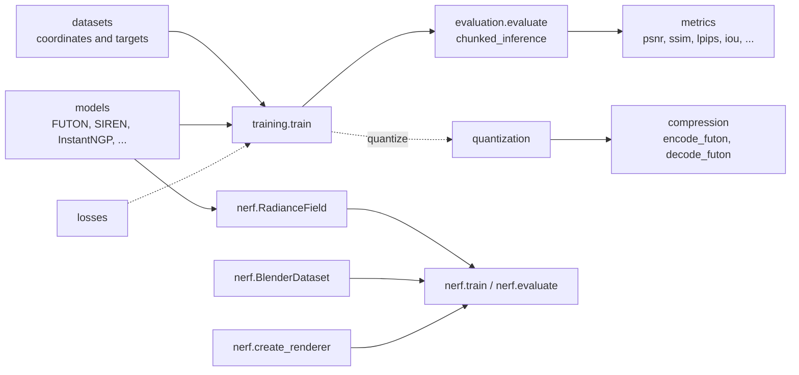

# Neural fields in NeuroField

A neural field, or implicit neural representation (INR), represents a signal $s$ as a parametric function of its coordinates,

$$
\hat{s}_\theta : [-1, 1]^C \to \mathbb{R}^D,
$$

fitted to samples of $s$ by minimizing a reconstruction loss. An image is a field on $[-1, 1]^2$ with $D = 3$; an occupancy volume a field on $[-1, 1]^3$ with $D = 1$; a radiance field a function of position and view direction. The library keeps this abstraction explicit: models are modules on coordinates, datasets are coordinate/value pairs, and one training loop serves every task that fits samples directly.

## Models

Every model maps a tensor of coordinates `(..., in_features)` in $[-1, 1]$ to values `(..., out_features)`, so it can be called on a single point, a batch, or a whole grid:

```python
model = nf.FUTON(
    2, 3, basis=("cosine", {"num_components": 64}), combiner=("cp", {"rank": 32}), decoder="linear"
)
model(torch.rand(10, 2) * 2 - 1).shape      # (10, 3)
model(torch.rand(4, 5, 2) * 2 - 1).shape    # (4, 5, 3)
```

The constructors share `in_features`, `out_features` and, where they apply, `hidden_features`, `hidden_layers` and `output_activation`. The [model zoo](models.md) lists them all. The two Deep Image Prior networks are the exception: they map a noise image `(B, C, H, W)` to an image and are paired with `DIPImageDataset`.

## Datasets

A dataset yields dictionaries with four keys:

| Key | Content |
| --- | --- |
| `id` | A name for the signal, used in logs and file names. |
| `input` | Coordinates to evaluate the model at. |
| `target` | The values to fit, in the model's output range. |
| `_original` | The reference signal in its native form (for example `uint8` `(C, H, W)`), used by the metrics. Keys with a leading underscore stay on the CPU. |

`ImageCoordinateDataset`, `OccupancyCoordinateDataset`, `MaskedImageCoordinateDataset`, `MRICoordinateDataset` and `DIPImageDataset` follow this scheme; the [conventions page](conventions.md) tabulates their shapes. Each holds one signal, so `len(dataset) == 1`, and random **subsampling** happens on access: with `subsample=0.1`, every `dataset[0]` returns a fresh random tenth of the coordinates and their values, flattened. This is how the benchmarks train, and it is why one epoch is one optimizer step.

Datasets also provide `preprocess` (native values to targets), `postprocess` (model output back to native values), and `save` (write a reconstruction to disk), which the evaluation loop uses, and a `to(device)` that moves the training tensors so that subsampling runs on the GPU.

## Training

`nf.train(model, train_dataset, eval_dataset, **options)` fits a model in place:

- **Optimizer.** Adam with `lr`, `weight_decay`, `adam_betas` and `adam_eps`. The hash-grid models use `(0.9, 0.99)` and `1e-15`, as in their reference implementations; the configs set this per model.
- **Schedule.** `CosineAnnealingLR` over `num_epochs`, stepped once per batch, down to `lr / 100`.
- **Loss.** `loss_fn(batch, model) -> (loss, metrics)`. The default is the mean squared error, logging the PSNR for targets in $[-1, 1]$. `nf.rate_distortion_loss` and `nf.sdf_loss` have the same signature, and so can yours; see [custom components](../tutorials/custom-components.md).
- **Evaluation.** Every `eval_interval` epochs (and at the end) the model is evaluated on `eval_dataset` with `nf.evaluate`, which reconstructs each item in chunks of `chunk_size` coordinates, maps the output through `postprocess`, and computes each function in `metrics` as `fn(reconstruction, original)`. Rate metrics, `fn(encoded_bytes, original)`, see the model's parameters serialized with `nf.encode_dict`.
- **Quantization.** With `quantize=True`, evaluation uses a uniformly quantized copy of the model (`quant_max` levels), optional fake-quantization steps run every `quant_interval` epochs, and the final model is quantized in place. See the [compression tutorial](../tutorials/compression.md).
- **Logging.** `log_dir` receives `log.txt`, `log.json`, the reconstructions of each evaluation, and `checkpoint.pt`; `ckpt_path` loads a state dict before training.

The return value is `{"config", "model_dict", "history"}`: the settings that were logged, the final parameters, and one record per logged epoch with the last batch's training metrics and, when the epoch was evaluated, the mean evaluation metrics under `"eval"`. The records are plain dictionaries, so `pd.DataFrame(result["history"])` gives a learning curve.

## Evaluation and inference

`nf.evaluate(model, dataset, metrics=...)` runs the evaluation half of the loop on its own, for example on a checkpoint (`ckpt_path`) or on another grid than the one trained on. `nf.chunked_inference(model, coordinates, chunk_size=...)` evaluates a model on any coordinate tensor under `torch.no_grad()`, flattening the leading dimensions for chunking and restoring them afterwards.

## Radiance fields

Novel view synthesis does not fit samples of the signal directly: the supervision is posed images, and the field is queried along rays. `nf.nerf` therefore has its own dataset (`BlenderDataset`), field (`RadianceField`, which wraps any model from the zoo as its density network), renderers, and `train` and `evaluate` functions with the same shape of return value. The [radiance field tutorial](../tutorials/nerf.md) covers them.

## How the modules fit together


