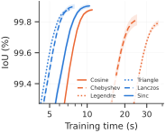
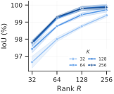
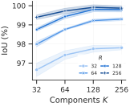
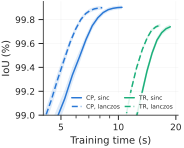

# Ablations

FUTON's four design choices, varied one at a time on the occupancy task (five Stanford shapes at $256^3$, 2000 epochs, learning rate 1e-2), plus two supplementary studies on images and radiance fields. Unless stated, the default model is the benchmark's: 128 components per axis, CP rank 218, a one-layer MLP decoder, 131,673 parameters. The configs are in `configs/ablation-futon/`, and every table and plot here is in `results/ablation/`.

## Basis

All six families at the default size. The number of parameters does not depend on the basis, so the columns are what each family costs and what it buys.

| Basis | Orthogonal | Support | Smoothness | Train time (s) ↓ | IoU (%) ↑ |
| --- | --- | --- | --- | --- | --- |
| Cosine | yes | global | $C^\infty$ | 11.0 | 99.88 ± 0.01 |
| Chebyshev | weighted | global | $C^\infty$ | 25.1 | 99.81 ± 0.04 |
| Legendre | yes | global | $C^\infty$ | 37.3 | 99.79 ± 0.02 |
| Triangle | no | compact | $C^0$ | **7.2** | 99.88 ± 0.01 |
| Lanczos | no | compact | $C^1$ | *7.9* | **99.90** ± 0.01 |
| Sinc | no | global | $C^\infty$ | 10.4 | **99.90** ± 0.01 |

<figure markdown="span">
  { width="520" }
  <figcaption>IoU against training time for every basis.</figcaption>
</figure>

The choice of family barely moves the final accuracy on the grid: every basis is within 0.1 IoU points, and the cardinal ones (sinc, Lanczos, triangle) are the best. It moves the training time by 5×. The cosine and sinc bases are tabulated on the grid (`grid_size=256`); the polynomial families are evaluated at every step by a sequential three-term recurrence, which is what makes them slow; and the local ones are fast because a coordinate touches two (triangle) or six (Lanczos-3) functions per axis, which the fused sparse kernels exploit. Lanczos is the sweet spot: sinc's accuracy at triangle's cost.

## Components against rank

The two sizes of a FUTON, the number of basis functions per axis $K$ and the CP rank $R$, both over {32, 64, 128, 256}, for the sinc basis (`components_rank.yaml`; the Lanczos results are in `results/ablation/` and match).

<figure markdown="span">
  { width="520" }
  { width="520" }
  <figcaption>IoU against the CP rank, one curve per number of components; and the same runs as IoU against the number of components, one curve per rank.</figcaption>
</figure>

Mean IoU (%) over the five shapes for the sinc basis (the Lanczos numbers are within 0.1 points of every cell):

| $K$ \ $R$ | 32 | 64 | 128 | 256 |
| --- | --- | --- | --- | --- |
| 32 | 96.65 | 97.99 | 98.76 | 99.40 |
| 64 | 97.42 | 98.76 | 99.43 | 99.73 |
| 128 | 97.75 | 99.22 | 99.80 | **99.92** |
| 256 | 97.80 | 99.30 | 99.80 | 99.87 |

Rank is the lever. At every $K$, each doubling of $R$ raises the IoU, by 0.6 to 1.3 points at the low end and still by 0.1 at the top. Components saturate: from $K = 128$ to $K = 256$ nothing is gained at any rank, because the MLP decoder makes up for the missing bandwidth, and at $K = 32$ the basis is too coarse for any rank to fix. This is why the benchmark models spend their budget on $R$: 218 at $K = 128$ rather than 144 at $K = 256$, which was 0.1 points worse at the same size.

## Combiner

A tensor-ring combiner against the CP one, at $K = 128$, for both bases. A ring of rank $r$ has the size of a CP combiner of rank $r^2$; rank 15 (137,476 parameters) is the closest match to the CP model (131,673).

| Combiner, decoder | Params (k) | FUTON-sinc time (s) ↓ | FUTON-sinc IoU (%) ↑ | FUTON-lanczos time (s) ↓ | FUTON-lanczos IoU (%) ↑ |
| --- | --- | --- | --- | --- | --- |
| CP, MLP | 131.7 | **10.4** | **99.90** ± 0.01 | **7.9** | **99.90** ± 0.01 |
| TR, MLP | 137.5 | 18.7 | 99.74 ± 0.02 | 16.6 | 99.75 ± 0.01 |

<figure markdown="span">
  { width="520" }
</figure>

CP wins on both counts: 0.15 IoU points and half the training time. The ring's $r \times r$ matrices per point cost more to contract than CP's $R$ products, and its output is only $r^2 = 225$ wide, which the decoder then has to close.

## Decoder

The paper's model has a linear decoder, which makes FUTON exactly a rank-$R$ CP model of the signal; the benchmarks use a one-layer MLP. Two supplementary studies measure the difference at equal size.

**Volumes** (five shapes, from `logs/decoder-local`). The MLP decoder holds 47,961 parameters, which a linear decoder returns to the combiner as CP rank 342; rank 218 with a linear decoder isolates the nonlinearity from the parameters.

| Decoder | CP rank | Params (k) | FUTON-sinc IoU (%) | FUTON-lanczos IoU (%) |
| --- | --- | --- | --- | --- |
| MLP, 1 hidden layer | 218 | 131.7 | 99.90 | 99.90 |
| linear | 342 | 131.7 | **99.93** | **99.94** |
| linear | 218 | 83.9 | 99.86 | 99.87 |

**Images** (kodim01, 09, 13 and 19, from `logs/decoder-image-kr`). Here the linear decoder is walked along the iso-parameter curve, from a quarter of the sampling resolution per axis at rank 602 to the full resolution at rank 152, all at about 194.5k parameters; an MLP at the full resolution is the control.

| Decoder | Components per axis | CP rank | FUTON-sinc PSNR (dB) | FUTON-lanczos PSNR (dB) |
| --- | --- | --- | --- | --- |
| MLP, 1 hidden layer | H/2, W/2 | 224 | **37.05** | **36.86** |
| MLP, 1 hidden layer | H, W | 137 | 36.07 | 36.06 |
| linear | H/4, W/4 | 602 | 23.82 | 23.72 |
| linear | H/2, W/2 | 302 | 28.17 | 27.91 |
| linear | 3H/4, 3W/4 | 202 | 31.72 | 31.59 |
| linear | H, W | 152 | 31.77 | 31.77 |

The two tasks disagree, and both make sense. An occupancy volume is nearly a low-rank tensor in a smooth basis, so at equal size the linear model's extra rank is worth more than the nonlinearity. A natural image is not: a rank-152 CP model of a $512 \times 768$ image tops out near 32 dB however the budget is split, and the one-layer MLP adds 5 dB on top of it. The MLP decoder is therefore the default, and the linear decoder remains the model to reason about.

**Radiance fields** (lego, from `logs/nerf-kr`): the image study's question, asked once of a radiance field. Doubling the components to $K = 256$ at the rank that pays for it ($R = 78$, 73,733 parameters) loses 0.7 dB against the benchmark's $K = 128$, $R = 128$ (31.05 dB), the same answer as on volumes: the rank is where the budget belongs.
