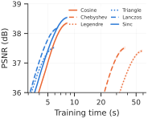
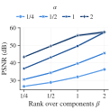
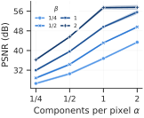
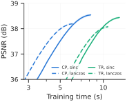

# Ablations

FUTON's four design choices, varied one at a time on the image task (the 24 Kodak images at 768 × 512, 2000 epochs on 10 % of the pixels per step, learning rate 3e-2), plus one supplementary study on a radiance field. Unless stated, the default model is the benchmark's: K = (H/2, W/2) components per axis, 384 × 256 for a landscape image, CP rank 224, a one-layer MLP decoder, 194,435 parameters. The configs are in `configs/ablation-futon/`, and every table and plot here is in `results/ablation/`. The times are the sweeps' own, from shared A100 nodes, so they compare the variants with each other rather than with the benchmark tables.

## Basis

All six families at the default size. The number of parameters does not depend on the basis, so the columns are what each family costs and what it buys.

| Basis | Orthogonal | Support | Smoothness | Train time (s) ↓ | PSNR (dB) ↑ |
| --- | --- | --- | --- | --- | --- |
| Cosine | yes | global | $C^\infty$ | 8.4 | *38.36* ± 0.05 |
| Chebyshev | weighted | global | $C^\infty$ | 37.9 | 37.52 ± 0.05 |
| Legendre | yes | global | $C^\infty$ | 58.9 | 37.41 ± 0.05 |
| Triangle | no | compact | $C^0$ | **5.9** | 37.53 ± 0.05 |
| Lanczos | no | compact | $C^1$ | *6.6* | 38.20 ± 0.04 |
| Sinc | no | global | $C^\infty$ | 8.3 | **38.54** ± 0.04 |

<figure markdown="span">
  { width="520" }
  <figcaption>PSNR against training time for every basis.</figcaption>
</figure>

The families fall into two groups a decibel apart, and that is the whole spread: sinc, cosine and Lanczos at 38.2 to 38.5 dB, triangle and the two polynomial families at 37.4 to 37.5. Training time varies 10×. The cosine and sinc bases are tabulated on the pixel grid (`grid_size = (H, W)`); the polynomial families are evaluated at every step by a three-term recurrence, which is what makes them slow, and buy no accuracy for it; the local ones are fast because a coordinate touches two (triangle) or six (Lanczos-3) functions per axis, which the fused sparse kernels exploit. Lanczos is the sweet spot, 0.3 dB behind sinc in 80 % of its time, and triangle, the cheapest, pays a full decibel for its $C^0$ kink.

## Components against rank

The two sizes of a FUTON, the number of components per axis and the CP rank, scaled with the image: K = (αH, αW) and R = β min(K), for α and β in {1/8, 1/4, 1/2, 1, 2}, 25 models per basis (`components_rank.yaml`). The sinc basis is shown; the Lanczos results are in `results/ablation/` and match. Because K and R both set the size, the grid spans 1,379 to 9,445,379 parameters, from a hundredth of the benchmark's budget to 48 times it, and its lower right holds more parameters than the image has values:

| α \ β | 1/8 | 1/4 | 1/2 | 1 | 2 |
| --- | --- | --- | --- | --- | --- |
| 1/8 | 1.4k | 2.9k | 6.3k | 14.6k | 37.4k |
| 1/4 | 5.4k | 11.4k | 24.8k | 57.9k | 148k |
| 1/2 | 21.6k | 45.3k | 98.8k | 230k | 592k |
| 1 | 86.3k | 181k | 394k | 920k | 2.36M |
| 2 | 345k | 722k | 1.57M | 3.67M | 9.45M |

Parameters per cell, $R^2 + (h + w + 4) R + 3$ for $K = (h, w)$; the benchmark's model sits in the third row between β = 1/2 and β = 1, at R = 224.

<figure markdown="span">
  { width="520" }
  { width="520" }
  <figcaption>PSNR against the rank factor β, one curve per component factor α; and the same runs against α, one curve per β.</figcaption>
</figure>

Mean PSNR (dB) over the 24 images for the sinc basis:

| α \ β | 1/8 | 1/4 | 1/2 | 1 | 2 |
| --- | --- | --- | --- | --- | --- |
| 1/8 | 22.28 | 24.00 | 25.55 | 27.32 | 29.68 |
| 1/4 | 24.65 | 26.59 | 28.83 | 31.98 | 36.25 |
| 1/2 | 27.60 | 30.53 | 34.36 | 39.62 | 45.60 |
| 1 | 31.72 | 36.76 | 43.12 | 49.60 | 57.44 |
| 2 | 36.81 | 43.37 | 49.60 | 55.64 | **57.59** |

Rank is the lever that keeps paying: at every α, each doubling of β raises the PSNR, by about 2 dB on the coarsest grid and by 5 to 8 dB on the finest, until the lower right, with more parameters than the image has values, fits it to within the 8-bit quantization step (58.9 dB). Components saturate at the sampling resolution. The cells (α, β) and (2α, β/2) share a rank, and along such a chain doubling K is worth 1 to 4 dB up to K = (H, W), more at higher ranks, and nothing beyond it: from one to two components per pixel the gain is at most 0.3 dB, and at R = 1024 a loss of 1.8 dB, for nearly twice the parameters. That is why the benchmark spends its budget on R at K = (H/2, W/2): near 200k parameters the cell (1/2, 1) reaches 39.6 dB where (1, 1/4) stays at 36.8 and (2, 1/8) at 36.8 for 345k, and the benchmark's R = 224 lands at 38.5 dB between the two middle cells of its row. The Lanczos grid is within 0.6 dB of every sinc cell except the lower right, where the local basis is a decibel ahead.

## Combiner

A tensor-ring combiner against the CP one, at the default K, for both bases. A ring of rank $r$ has the size of a CP combiner of rank $r^2$; rank 15 (195,528 parameters) is the closest match to the CP model (194,435).

| Combiner, decoder | Params (k) | FUTON-sinc time (s) ↓ | FUTON-sinc PSNR (dB) ↑ | FUTON-lanczos time (s) ↓ | FUTON-lanczos PSNR (dB) ↑ |
| --- | --- | --- | --- | --- | --- |
| CP, MLP | 194.4 | **8.3** | **38.54** ± 0.04 | **6.6** | **38.20** ± 0.04 |
| TR, MLP | 195.5 | 13.0 | 38.44 ± 0.04 | 10.8 | 38.08 ± 0.04 |

<figure markdown="span">
  { width="520" }
</figure>

CP wins on both counts, by 0.1 dB and 1.6× in training time. The ring's $r \times r$ matrices per point cost more to contract than CP's $R$ products, and its output is only $r^2 = 225$ wide, which the decoder then has to close.

## Decoder

The paper's model has a linear decoder, which makes FUTON exactly a rank-$R$ CP model of the signal; the benchmarks use a one-layer MLP. Replacing the MLP by a linear map at rank 224 frees 50,400 parameters (144,035 remain), and spending them on the combiner raises the rank to 302 at the benchmark's size (194,189); the rank-224 linear model isolates the nonlinearity from the parameters.

| Decoder | CP rank | Params (k) | FUTON-sinc PSNR (dB) | FUTON-lanczos PSNR (dB) |
| --- | --- | --- | --- | --- |
| MLP, 1 hidden layer | 224 | 194.4 | **38.54** | **38.20** |
| linear | 302 | 194.2 | 30.40 | 29.95 |
| linear | 224 | 144.0 | 30.16 | 29.74 |

A natural image is far from a low-rank tensor in a smooth basis: at equal size the linear model reaches 30.4 dB, and the extra rank it buys over the rank-224 one is worth 0.2 dB, while the one-layer MLP adds 8 dB on top of it. The MLP decoder is therefore the default, and the linear decoder remains the model to reason about.

## Radiance fields

The components question, asked once of a radiance field (lego, `components_nerf.yaml`): twice the components, K = 256, at the rank that pays for them, R = 78 (73,733 parameters), against the benchmark's K = 128 and R = 128 (74,131). The benchmark's split wins by 0.8 dB, 30.91 against 30.12 dB on the test views, with the same training time: on a radiance field as on an image, the rank is where the budget belongs once the grid resolves the signal.
