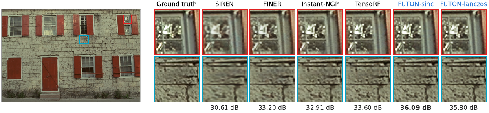
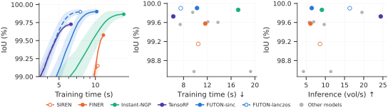
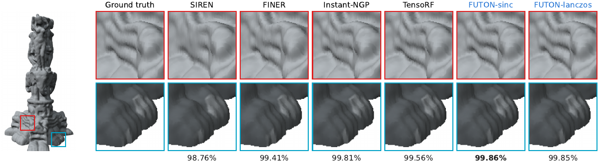
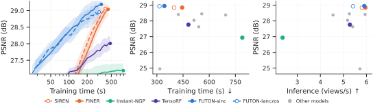
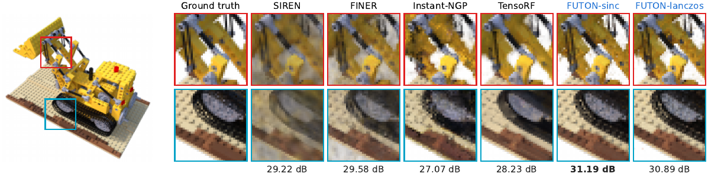

# Benchmarks

Twelve models on three tasks, at equal parameter count per task. The tables are `results/<task>/table.md` as `scripts/report_paper.py` writes them from the runs in `logs/`; the figures are the paper's. Bold marks the best value in a column and italics the second; ± is one standard error over the signals, after removing each signal's own level (a paired standard error).

Two notes on the rows. **TensoRF** is the variant its authors recommend for the dimension: CP on images (the only one in 2D) and VM on volumes and radiance fields; both are in the configs. **WIRE** is the real Gabor variant (`nf.RealWIRE`) from the WIRE paper and code. Training times were measured on one A100 in jobs that shared their nodes, so they carry some noise; the ordering is robust, the second decimal is not.

## Images

24 Kodak images at 768 × 512, about 195k parameters per model, 2000 epochs on 10 % of the pixels per step, scored on every pixel.

| Model | Params (k) | Train time (s) ↓ | PSNR (dB) ↑ | SSIM (%) ↑ | LPIPS ↓ |
| --- | --- | --- | --- | --- | --- |
| RFF | 199.7 | 9.6 | 29.80 ± 0.13 | 82.06 ± 0.84 | 0.3013 ± 0.0069 |
| PE-MLP | 196.7 | 11.6 | 28.03 ± 0.13 | 73.43 ± 1.35 | 0.4191 ± 0.0069 |
| MFN | 198.1 | 34.4 | 35.62 ± 0.15 | 92.16 ± 0.24 | 0.1567 ± 0.0041 |
| SIREN | 198.9 | 13.0 | 33.56 ± 0.15 | 90.69 ± 0.27 | 0.1986 ± 0.0051 |
| Gauss | 198.9 | 15.5 | 31.84 ± 0.22 | 86.48 ± 0.58 | 0.2292 ± 0.0052 |
| WIRE | 199.3 | 18.6 | 33.14 ± 0.41 | 89.20 ± 0.96 | 0.1909 ± 0.0117 |
| FINER | 198.9 | 14.6 | 35.94 ± 0.11 | 93.62 ± 0.26 | 0.1303 ± 0.0032 |
| Instant-NGP | 195.3 | 26.9 | 36.76 ± 0.12 | 93.84 ± 0.19 | 0.1274 ± 0.0031 |
| TensoRF | 202.0 | 10.1 | 36.59 ± 0.12 | 93.40 ± 0.21 | 0.1387 ± 0.0028 |
| GA-Planes | 194.8 | *7.9* | 33.30 ± 0.19 | 89.27 ± 0.40 | 0.2091 ± 0.0047 |
| FUTON-sinc | 194.4 | 8.1 | **38.54** ± 0.10 | **95.53** ± 0.35 | **0.0976** ± 0.0026 |
| FUTON-lanczos | 194.4 | **6.6** | *38.20* ± 0.10 | *95.24* ± 0.35 | *0.0998* ± 0.0027 |

<figure markdown="span">
  { width="960" }
  <figcaption>PSNR against training time for FUTON and the strongest model of each family, the band one within-image standard error; every model's final PSNR against its training time; and against its inference rate, in images per second.</figcaption>
</figure>

<figure markdown="span">
  
  
  <figcaption>kodim19 and kodim01: two regions of fine detail magnified for the ground truth and every featured model, with each model's PSNR over the whole image.</figcaption>
</figure>

## Occupancy

Five Stanford shapes voxelized at $256^3$, about 132k parameters per model, 2000 epochs on 1 % of the voxels per step, scored by IoU on every voxel.

| Model | Params (k) | Train time (s) ↓ | Armadillo | Dragon | Happy Buddha | Lucy | Thai Statue | Mean IoU (%) ↑ |
| --- | --- | --- | --- | --- | --- | --- | --- | --- |
| RFF | 132.2 | **7.5** | 99.85 | 99.84 | 99.68 | 98.76 | 99.66 | 99.56 ± 0.18 |
| PE-MLP | 131.3 | 9.9 | 98.96 | 98.53 | 98.96 | 98.21 | 98.19 | 98.57 ± 0.14 |
| MFN | 133.8 | 20.4 | 99.16 | 97.99 | 97.93 | 98.64 | 99.12 | 98.57 ± 0.29 |
| SIREN | 132.9 | 10.5 | 99.00 | 99.34 | 99.57 | 99.09 | 98.76 | 99.15 ± 0.14 |
| Gauss | 132.9 | 12.2 | 99.70 | 99.75 | 99.59 | 99.62 | 99.41 | 99.61 ± 0.05 |
| WIRE | 133.4 | 15.4 | 99.65 | 99.70 | 99.60 | 99.60 | 99.45 | 99.60 ± 0.04 |
| FINER | 132.9 | 11.8 | 99.54 | 99.67 | 99.70 | 99.56 | 99.41 | 99.58 ± 0.05 |
| Instant-NGP | 132.4 | 26.7 | 99.91 | *99.90* | 99.81 | **99.90** | 99.81 | 99.87 ± 0.04 |
| TensoRF | 130.0 | *7.6* | 99.82 | 99.86 | 99.79 | 99.60 | 99.56 | 99.73 ± 0.03 |
| GA-Planes | 132.0 | 9.9 | 99.80 | 99.87 | 99.88 | 99.80 | 99.71 | 99.81 ± 0.04 |
| FUTON-sinc | 131.7 | 11.2 | **99.95** | **99.91** | **99.92** | 99.87 | **99.86** | **99.90** ± 0.03 |
| FUTON-lanczos | 131.7 | 8.8 | **99.95** | *99.90* | **99.92** | *99.88* | *99.85* | **99.90** ± 0.03 |

<figure markdown="span">
  { width="960" }
  <figcaption>IoU against training time for the featured models; every model's final IoU against its training time; and against its inference rate, in volumes per second.</figcaption>
</figure>

<figure markdown="span">
  
  <figcaption>The Thai statue, reconstructed from each model's checkpoint by marching cubes and rendered offscreen.</figcaption>
</figure>

## Radiance fields

Eight NeRF synthetic (Blender) scenes under FINER's protocol: 200 × 200 views, 25 training views, 37,500 steps of 4096 rays, scored on all 200 test views. Every model is the density network of the same radiance field (15 geometry features, spherical-harmonics direction encoding, a 64 × 2 colour MLP), about 75k parameters in all.

| Model | Params (k) | Train time (s) ↓ | PSNR (dB) ↑ | SSIM (%) ↑ | LPIPS ↓ |
| --- | --- | --- | --- | --- | --- |
| RFF | 74.5 | *317.1* | 24.95 ± 0.61 | 86.94 ± 1.70 | 0.2168 ± 0.0174 |
| PE-MLP | 86.0 | 422.8 | 28.41 ± 0.13 | 93.53 ± 0.24 | 0.0720 ± 0.0044 |
| MFN | 75.8 | 694.1 | 28.38 ± 0.16 | 93.30 ± 0.20 | 0.0743 ± 0.0034 |
| SIREN | 75.2 | 398.7 | 28.84 ± 0.12 | 93.71 ± 0.19 | 0.0976 ± 0.0093 |
| Gauss | 75.2 | 540.0 | 27.63 ± 0.13 | 92.35 ± 0.16 | 0.1050 ± 0.0069 |
| WIRE | 74.5 | 557.4 | 28.45 ± 0.14 | 93.11 ± 0.12 | 0.1127 ± 0.0042 |
| FINER | 75.2 | 444.7 | 28.85 ± 0.15 | 93.59 ± 0.22 | 0.1157 ± 0.0127 |
| Instant-NGP | 75.0 | 789.6 | 26.94 ± 0.16 | 91.74 ± 0.35 | 0.1001 ± 0.0061 |
| TensoRF | 74.8 | 480.6 | 27.76 ± 0.24 | 93.13 ± 0.31 | 0.0750 ± 0.0053 |
| GA-Planes | 75.0 | 512.5 | 28.04 ± 0.27 | 93.58 ± 0.43 | 0.0698 ± 0.0050 |
| FUTON-sinc | 74.1 | 342.8 | **28.95** ± 0.29 | **94.31** ± 0.44 | **0.0660** ± 0.0061 |
| FUTON-lanczos | 74.1 | **314.9** | *28.93* ± 0.28 | *94.26* ± 0.46 | *0.0662* ± 0.0060 |

Per scene, the picture is mixed, which the mean hides: FUTON leads on lego, materials, hotdog and ship, and trails FINER and SIREN on chair, drums, ficus and mic.

| Model | Chair | Drums | Ficus | Hotdog | Lego | Materials | Mic | Ship |
| --- | --- | --- | --- | --- | --- | --- | --- | --- |
| RFF | 28.36 | 19.89 | 26.13 | 26.97 | 23.72 | 23.00 | 31.67 | 19.87 |
| PE-MLP | 32.72 | 23.81 | 26.89 | 32.06 | 29.51 | 26.47 | 32.63 | 23.18 |
| MFN | 33.01 | 23.73 | 27.48 | 32.82 | 28.80 | 25.59 | 33.23 | 22.37 |
| SIREN | *33.21* | *24.59* | **27.96** | 32.84 | 29.22 | 26.58 | **33.82** | 22.51 |
| Gauss | 31.44 | 23.69 | 26.42 | 32.01 | 27.77 | 25.22 | 32.37 | 22.08 |
| WIRE | 32.50 | 24.22 | 27.77 | 32.43 | 28.83 | 26.20 | *33.53* | 22.11 |
| FINER | **33.47** | **24.62** | *27.85* | *33.23* | 29.58 | 26.19 | 33.41 | 22.42 |
| Instant-NGP | 31.18 | 22.46 | 26.03 | 31.20 | 27.07 | 24.62 | 32.28 | 20.67 |
| TensoRF | 31.74 | 23.90 | 26.15 | 32.26 | 28.23 | 26.05 | 31.14 | 22.65 |
| GA-Planes | 31.98 | 23.69 | 25.42 | 31.96 | 29.56 | 26.55 | 32.27 | 22.89 |
| FUTON-sinc | 33.01 | 24.38 | 27.00 | 33.08 | **31.19** | **27.29** | 32.45 | *23.19* |
| FUTON-lanczos | 32.97 | 24.09 | 26.82 | **33.61** | *30.89* | *27.23* | 32.61 | **23.21** |

Test-view PSNR in dB. `results/nerf/table.md` also lists SSIM and LPIPS per scene.

<figure markdown="span">
  { width="960" }
  <figcaption>Validation PSNR against training time for the featured models; every model's final test PSNR against its training time; and against its rendering rate, in views per second.</figcaption>
</figure>

<figure markdown="span">
  
  <figcaption>The lego scene from a test view, with two regions magnified.</figcaption>
</figure>

<figure markdown="span">
  { width="720" }
  <figcaption>The same scene in orbit: SIREN, Instant-NGP and FUTON-sinc, with their test-view PSNR.</figcaption>
</figure>

## Reading the numbers

- **Accuracy.** FUTON leads every column of the image table by a margin well beyond the error bars (1.8 dB over Instant-NGP), and the mean IoU on volumes, where the hash grid is its only close competitor. On radiance fields the mean is a narrow lead over FINER and SIREN, within one standard error.
- **Speed.** FUTON-lanczos is the fastest model to train on images and the fastest radiance field; on volumes RFF and TensoRF train faster but reach a lower IoU. Instant-NGP, the other strong model, is 2 to 3× slower than FUTON here; its hash grid runs in plain PyTorch, like every other model, rather than in tiny-cuda-nn's fused kernels.
- **The two bases** trade a little accuracy for speed: Lanczos costs 0.3 dB on images and nothing on volumes, and trains 8 to 20 % faster.

The [ablations](ablations.md) take FUTON apart, and [Reproducing the paper](reproduce.md) has the commands that produced every number above.
