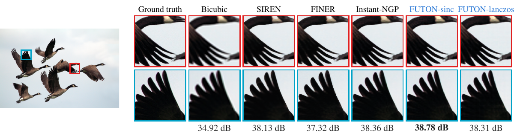

# Benchmarks

Twelve models on four tasks, at equal parameter count per task; the fourth, super-resolution, adds the deep image prior and three interpolations as references. The tables are `results/<task>/table.md` as `scripts/report_paper.py` writes them from the runs in `logs/`; the figures are the paper's. Bold marks the best value in a column and italics the second; ± is one standard error over the signals, after removing each signal's own level (a paired standard error); IoU, which saturates near 100 % on every shape, takes the plain standard error over the shapes.

Two notes on the rows. **TensoRF** is the variant its authors recommend for the dimension: CP on images (the only one in 2D) and VM on volumes and radiance fields; both are in the configs. **WIRE** is the real Gabor variant (`nf.RealWIRE`) from the WIRE paper and code.

Accuracy comes from the benchmark sweeps. Times are measured separately: every model was retrained alone on an A100 after a warm-up pass, on all 24 images and 5 shapes, on the lego and hotdog scenes and on DIV2K images 0801 and 0882, and the tables and figures take their training times from those runs, so a radiance-field or super-resolution time is the mean over its two timed signals. The inference throughputs in the figures come from the same kind of job (`scripts/profile_speed.py`). The sweeps' own times were within 6 % of these on radiance fields and within 12 % on super-resolution; the image and volume sweeps ran beside other jobs, and there Instant-NGP came out 1.7× slower.

## Images

24 Kodak images at 768 × 512, about 195k parameters per model, 2000 epochs on 10 % of the pixels per step, scored on every pixel.

| Model | #Params (k) | Training time (s) ↓ | Training memory (MB) ↓ | Inference throughput (MPix/s) ↑ | Inference memory (GB) ↓ | PSNR (dB) ↑ | SSIM ↑ | LPIPS ↓ |
| --- | --- | --- | --- | --- | --- | --- | --- | --- |
| RFF | 199.7 | 9.5 | 283 | 27.9 | 2.01 | 29.80 ± 0.13 | 0.821 ± 0.008 | 0.301 ± 0.007 |
| PE-MLP | 196.7 | 11.5 | 285 | 27.2 | 1.24 | 28.03 ± 0.13 | 0.734 ± 0.014 | 0.419 ± 0.007 |
| MFN | 198.1 | 24.7 | 1118 | 11.7 | 1.98 | 35.62 ± 0.15 | 0.922 ± 0.002 | 0.157 ± 0.004 |
| SIREN | 198.9 | 12.7 | 404 | 27.7 | _1.21_ | 33.56 ± 0.15 | 0.907 ± 0.003 | 0.199 ± 0.005 |
| Gauss | 198.9 | 15.0 | 444 | 19.8 | _1.21_ | 31.84 ± 0.22 | 0.865 ± 0.006 | 0.229 ± 0.005 |
| WIRE | 199.3 | 17.1 | 644 | 16.5 | 1.71 | 33.14 ± 0.41 | 0.892 ± 0.010 | 0.191 ± 0.012 |
| FINER | 198.9 | 14.3 | 565 | 16.7 | 2.02 | 35.94 ± 0.11 | 0.936 ± 0.003 | 0.130 ± 0.003 |
| Instant-NGP | 195.3 | _6.3_ | 277 | 58.2 | 2.52 | 36.76 ± 0.12 | 0.938 ± 0.002 | 0.127 ± 0.003 |
| TensoRF | 202.0 | 9.9 | 287 | 42.8 | 1.48 | 36.59 ± 0.12 | 0.934 ± 0.002 | 0.139 ± 0.003 |
| GA-Planes | 194.8 | 7.8 | _220_ | _61.3_ | 1.29 | 33.30 ± 0.19 | 0.893 ± 0.004 | 0.209 ± 0.005 |
| FUTON-sinc | 194.4 | 8.1 | 352 | 30.9 | 2.06 | **38.54** ± 0.10 | **0.955** ± 0.003 | **0.098** ± 0.003 |
| FUTON-lanczos | 194.4 | **5.6** | **181** | **92.1** | **1.08** | _38.20_ ± 0.10 | _0.952_ ± 0.003 | _0.100_ ± 0.003 |

<figure markdown="span">
  { width="960" }
  <figcaption>PSNR against training time for FUTON and the strongest model of each family, the band one within-image standard error; every model's final PSNR against its training time; and against its inference throughput.</figcaption>
</figure>

<figure markdown="span">
  
  
  <figcaption>kodim19 and kodim01: two regions of fine detail magnified for the ground truth and every featured model, with each model's PSNR over the whole image.</figcaption>
</figure>

## Occupancy

Five Stanford shapes voxelized at 256 samples per unit length and cropped to their bounds (2.1 to 7.9 million voxels, the longest side 231), about 132k parameters per model, 2000 epochs on 1 % of the voxels per step, scored by IoU on every voxel.

| Model | #Params (k) | Training time (s) ↓ | Training memory (MB) ↓ | Inference throughput (MVox/s) ↑ | Inference memory (GB) ↓ | IoU (%) Armadillo ↑ | IoU (%) Dragon ↑ | IoU (%) Happy Buddha ↑ | IoU (%) Lucy ↑ | IoU (%) Thai Statue ↑ | IoU (%) Mean ↑ |
| --- | --- | --- | --- | --- | --- | --- | --- | --- | --- | --- | --- |
| RFF | 132.2 | _7.4_ | 221 | 36.3 | 1.36 | 99.85 | 99.84 | 99.68 | 98.76 | 99.66 | 99.56 ± 0.20 |
| PE-MLP | 131.3 | 9.8 | 230 | 33.3 | 0.84 | 98.96 | 98.53 | 98.96 | 98.21 | 98.19 | 98.57 ± 0.17 |
| MFN | 133.8 | 19.3 | 805 | 16.0 | 1.33 | 99.16 | 97.99 | 97.93 | 98.64 | 99.12 | 98.57 ± 0.27 |
| SIREN | 132.9 | 10.5 | 320 | 38.5 | 0.82 | 99.00 | 99.34 | 99.57 | 99.09 | 98.76 | 99.15 ± 0.14 |
| Gauss | 132.9 | 12.1 | 359 | 29.7 | 0.82 | 99.70 | 99.75 | 99.59 | 99.62 | 99.41 | 99.61 ± 0.06 |
| WIRE | 133.4 | 13.8 | 468 | 22.2 | 1.16 | 99.65 | 99.70 | 99.60 | 99.60 | 99.45 | 99.60 ± 0.04 |
| FINER | 132.9 | 11.7 | 439 | 26.2 | 1.36 | 99.54 | 99.67 | 99.70 | 99.56 | 99.41 | 99.58 ± 0.05 |
| Instant-NGP | 132.4 | 10.3 | 535 | 27.1 | 3.39 | 99.91 | _99.90_ | 99.81 | **99.90** | 99.81 | 99.87 ± 0.02 |
| TensoRF | 130.0 | **6.3** | **107** | **91.1** | **0.43** | 99.82 | 99.86 | 99.79 | 99.60 | 99.56 | 99.73 ± 0.06 |
| GA-Planes | 132.0 | 9.5 | 146 | _74.0_ | _0.55_ | 99.80 | 99.87 | 99.88 | 99.80 | 99.71 | 99.81 ± 0.03 |
| FUTON-sinc | 131.7 | 10.3 | 327 | 26.1 | 1.33 | **99.95** | **99.91** | **99.92** | 99.87 | **99.86** | **99.90** ± 0.02 |
| FUTON-lanczos | 131.7 | _7.4_ | _137_ | 68.3 | 0.73 | **99.95** | _99.90_ | **99.92** | _99.88_ | _99.85_ | **99.90** ± 0.02 |

<figure markdown="span">
  { width="960" }
  <figcaption>IoU against training time for the featured models; every model's final IoU against its training time; and against its inference throughput, in megavoxels per second.</figcaption>
</figure>

<figure markdown="span">
  
  <figcaption>The Thai statue, reconstructed from each model's checkpoint by marching cubes and rendered offscreen.</figcaption>
</figure>

## Radiance fields

Eight NeRF synthetic (Blender) scenes under FINER's protocol: 200 × 200 views, 25 training views, 37,500 steps of 4096 rays, scored on all 200 test views. Every model is the density network of the same radiance field (15 geometry features, spherical-harmonics direction encoding, a 64 × 2 colour MLP), about 75k parameters in all.

| Model | #Params (k) | Training time (s) ↓ | Training memory (GB) ↓ | Inference FPS ↑ | Inference memory (MB) ↓ | PSNR (dB) ↑ | SSIM ↑ | LPIPS ↓ |
| --- | --- | --- | --- | --- | --- | --- | --- | --- |
| RFF | 74.5 | 364.0 | 3.36 | **6.3** | 111 | 28.53 ± 0.30 | 0.932 ± 0.004 | 0.077 ± 0.005 |
| PE-MLP | 75.1 | 400.8 | 3.21 | **6.3** | 92 | 28.35 ± 0.18 | 0.935 ± 0.002 | 0.072 ± 0.004 |
| MFN | 75.8 | 784.5 | 13.98 | 4.9 | 144 | 28.38 ± 0.15 | 0.933 ± 0.002 | 0.074 ± 0.003 |
| SIREN | 75.2 | 441.6 | 5.52 | 6.2 | 85 | 28.84 ± 0.13 | 0.937 ± 0.001 | 0.098 ± 0.009 |
| Gauss | 75.2 | 560.2 | 5.87 | 5.4 | 101 | 27.63 ± 0.15 | 0.923 ± 0.003 | 0.105 ± 0.008 |
| WIRE | 74.5 | 604.3 | 7.81 | 5.4 | 113 | 28.45 ± 0.15 | 0.931 ± 0.002 | 0.113 ± 0.005 |
| FINER | 75.2 | 501.9 | 7.64 | 5.5 | 131 | 28.85 ± 0.13 | 0.936 ± 0.001 | 0.116 ± 0.013 |
| Instant-NGP | 75.0 | 582.2 | 12.77 | 5.4 | 455 | 26.94 ± 0.17 | 0.917 ± 0.005 | 0.100 ± 0.007 |
| TensoRF | 74.8 | 532.0 | 2.61 | 5.6 | _76_ | 27.76 ± 0.23 | 0.931 ± 0.002 | 0.075 ± 0.005 |
| GA-Planes | 75.0 | 578.0 | _2.55_ | 5.4 | 81 | 28.04 ± 0.26 | 0.936 ± 0.003 | 0.070 ± 0.004 |
| FUTON-sinc | 74.1 | _359.5_ | 5.54 | 5.6 | 133 | **28.95** ± 0.27 | **0.943** ± 0.003 | **0.066** ± 0.005 |
| FUTON-lanczos | 74.1 | **311.7** | **2.21** | 5.4 | **74** | _28.93_ ± 0.25 | **0.943** ± 0.003 | **0.066** ± 0.005 |

Per scene, the picture is mixed, which the mean hides: FUTON leads on lego, materials, hotdog and ship, and trails FINER on chair and drums, RFF on ficus and SIREN on mic.

| Model | Chair | Drums | Ficus | Hotdog | Lego | Materials | Mic | Ship |
| --- | --- | --- | --- | --- | --- | --- | --- | --- |
| RFF | _33.43_ | 23.86 | **28.04** | 33.09 | 28.89 | 26.17 | _33.76_ | 21.03 |
| PE-MLP | 32.50 | 23.58 | 26.42 | 32.01 | 29.18 | 26.69 | 33.29 | 23.14 |
| MFN | 33.01 | 23.73 | 27.48 | 32.82 | 28.80 | 25.59 | 33.23 | 22.37 |
| SIREN | 33.21 | _24.59_ | _27.96_ | 32.84 | 29.22 | 26.58 | **33.82** | 22.51 |
| Gauss | 31.44 | 23.69 | 26.42 | 32.01 | 27.77 | 25.22 | 32.37 | 22.08 |
| WIRE | 32.50 | 24.22 | 27.77 | 32.43 | 28.83 | 26.20 | 33.53 | 22.11 |
| FINER | **33.47** | **24.62** | 27.85 | _33.23_ | 29.58 | 26.19 | 33.41 | 22.42 |
| Instant-NGP | 31.18 | 22.46 | 26.03 | 31.20 | 27.07 | 24.62 | 32.28 | 20.67 |
| TensoRF | 31.74 | 23.90 | 26.15 | 32.26 | 28.23 | 26.05 | 31.14 | 22.65 |
| GA-Planes | 31.98 | 23.69 | 25.42 | 31.96 | 29.56 | 26.55 | 32.27 | 22.89 |
| FUTON-sinc | 33.01 | 24.38 | 27.00 | 33.08 | **31.19** | **27.29** | 32.45 | _23.19_ |
| FUTON-lanczos | 32.97 | 24.09 | 26.82 | **33.61** | _30.89_ | _27.23_ | 32.61 | **23.21** |

Test-view PSNR in dB. `results/nerf/table.md` also lists SSIM and LPIPS per scene.

<figure markdown="span">
  { width="960" }
  <figcaption>Validation PSNR against training time for the featured models; every model's final test PSNR against its training time; and against its rendering speed, in frames per second.</figcaption>
</figure>

<figure markdown="span">
  
  <figcaption>The lego scene from a test view, with two regions magnified.</figcaption>
</figure>

<figure markdown="span">
  { width="720" }
  <figcaption>The same scene in orbit: SIREN, Instant-NGP and FUTON-sinc, with their test-view PSNR.</figcaption>
</figure>

## Super-resolution

The 100 DIV2K validation images, observed at a quarter of their size. Each image, about 2040 × 1356 pixels, is downsampled 4× with the antialiased bicubic filter of MATLAB's `imresize`, the standard protocol, and the models see nothing but the result, about 510 × 339 pixels. A field maps the high-resolution coordinates to RGB and is trained through the downsampling operator: a step draws 5 % of the low-resolution pixels in 8 × 8 blocks, evaluates the field at the high-resolution pixels beneath them (about 260k evaluations), downsamples the result with the same filter and takes the L1 distance to the observed pixels, for 2000 steps at about 500k parameters per model. The deep image prior (DIP) trains its convolutional generator through the same operator and joins nearest, bilinear and bicubic interpolation as a reference row. FUTON's grid of components is the low-resolution size, K = (H/4, W/4), and its rank the largest within the budget on each image (399 on 0882), since the grid follows the image's size where the baselines' widths do not. Every model's scale and learning rate were chosen on three DIV2K training images (0395, 0431 and 0777) by the mean gain over bicubic, with the L1 loss throughout. PSNR and SSIM are computed on the luma channel after shaving a 4-pixel border, LPIPS on RGB, all against the original image.

| Model | #Params (k) | Training time (s) ↓ | Training memory (GB) ↓ | Inference throughput (MPix/s) ↑ | Inference memory (GB) ↓ | PSNR (dB) ↑ | SSIM ↑ | LPIPS ↓ |
| --- | --- | --- | --- | --- | --- | --- | --- | --- |
| Nearest | – | – | – | – | – | 26.73 ± 0.08 | 0.734 ± 0.001 | 0.459 ± 0.005 |
| Bilinear | – | – | – | – | – | 27.53 ± 0.04 | 0.757 ± 0.001 | 0.368 ± 0.002 |
| Bicubic | – | – | – | – | – | 28.10 ± 0.04 | 0.775 ± 0.002 | **0.353** ± 0.003 |
| DIP | 505.3 | 268.5 | 11.40 | _50.0_ | 3.52 | 28.07 ± 0.05 | 0.758 ± 0.002 | 0.417 ± 0.004 |
| RFF | 500.0 | 105.0 | 2.56 | 13.1 | 1.79 | 27.15 ± 0.09 | 0.735 ± 0.002 | 0.446 ± 0.003 |
| PE-MLP | 502.1 | 119.8 | 2.56 | 12.9 | 1.34 | 22.61 ± 0.21 | 0.614 ± 0.006 | 0.580 ± 0.005 |
| MFN | 501.8 | 222.9 | 11.84 | 6.3 | 2.15 | 27.61 ± 0.10 | 0.750 ± 0.002 | 0.428 ± 0.002 |
| SIREN | 500.6 | 130.7 | 4.26 | 11.9 | _1.31_ | _28.69_ ± 0.07 | _0.779_ ± 0.001 | 0.376 ± 0.002 |
| Gauss | 500.6 | 152.0 | 4.69 | 10.2 | _1.31_ | 26.23 ± 0.10 | 0.617 ± 0.005 | 0.520 ± 0.007 |
| WIRE | 502.0 | 171.8 | 6.64 | 9.6 | 1.84 | 26.23 ± 0.07 | 0.709 ± 0.002 | 0.490 ± 0.002 |
| FINER | 500.6 | 145.9 | 5.96 | 9.2 | 2.17 | 28.37 ± 0.06 | 0.751 ± 0.002 | 0.399 ± 0.003 |
| Instant-NGP | 505.2 | **30.8** | **1.64** | **66.0** | 1.53 | 28.39 ± 0.06 | 0.770 ± 0.001 | 0.378 ± 0.002 |
| TensoRF | 500.4 | 80.7 | 2.97 | 28.7 | 1.81 | 27.99 ± 0.04 | 0.763 ± 0.001 | 0.402 ± 0.002 |
| GA-Planes | 501.3 | 68.8 | 1.79 | 21.8 | **1.19** | 28.26 ± 0.05 | 0.767 ± 0.001 | 0.393 ± 0.002 |
| FUTON-sinc | 499.3 | 92.8 | 3.39 | 13.7 | 2.18 | **28.83** ± 0.07 | **0.790** ± 0.002 | _0.367_ ± 0.002 |
| FUTON-lanczos | 499.3 | _47.7_ | _1.69_ | 36.2 | _1.31_ | 28.65 ± 0.06 | _0.779_ ± 0.002 | 0.386 ± 0.002 |

<figure markdown="span">
  { width="960" }
  <figcaption>PSNR against training time for FUTON and the strongest model of each family, with bicubic interpolation as the dotted level; every model's final PSNR against its training time, PE-MLP at 22.6 dB as a marker on the axis line; and against its inference throughput, in megapixels per second.</figcaption>
</figure>

<figure markdown="span">
  
  
  <figcaption>DIV2K 0882 and 0896: the butterfly's head and a hindwing, and two wing tips of the geese, magnified for the original, bicubic interpolation and the featured fields, with each model's PSNR over the whole image. Bicubic stands in for TensoRF here, the weakest featured model on this task, so that the reference every model is measured against is in view.</figcaption>
</figure>

Super-resolution is the hardest task here for every model: nothing but the low-resolution image is seen, so the margins are fractions of a decibel and several fields lose to bicubic interpolation. FUTON-sinc beats bicubic on 99 of the 100 images, by 0.72 dB on average and 1.8 dB on 0882, and leads PSNR and SSIM; SIREN (ahead of bicubic on 90 images) and FUTON-lanczos (on 94, in 48 s) follow within 0.2 dB. Instant-NGP, the fastest model to train here at 31 s, FINER and GA-Planes gain 0.15 to 0.3 dB on average but lose to bicubic on more than a third of the images; the deep image prior and TensoRF do not beat it. The deep image prior is still improving when its 2000 steps end: with five times as many it gains 0.5 dB on 0801 and 1.3 dB on 0882, for five times the training time, so its paper's margin over bicubic needs a budget the protocol does not give it. Bicubic keeps the best LPIPS, by 0.015 over FUTON-sinc, which suggests the fields buy their PSNR at edges rather than in texture, the one thing a single low-resolution image cannot teach. PE-MLP is the one model the protocol does not serve: at the learning rate 3e-3 that suits most images it collapses on dark ones under the L1 loss, so the tuning images chose 3e-4, at which it is still climbing when the 2000 steps end, 5.5 dB below bicubic on average and below 20 dB on 14 images.

## Reading the numbers

- **Accuracy.** FUTON leads every column of the image table by a margin well beyond the error bars (1.8 dB over Instant-NGP), and the mean IoU on volumes, where the hash grid is its only close competitor. On radiance fields the mean is a narrow lead over FINER and SIREN, within one standard error; on super-resolution the lead over SIREN is 0.14 dB and holds on 76 of the 100 images.
- **Speed.** FUTON-lanczos is the fastest model to train on images and radiance fields; on volumes RFF and TensoRF train faster but reach a lower IoU. Instant-NGP, the other strong model, trails it on images (6.3 against 5.6 s), by 1.4× on volumes and 1.9× on radiance fields, and beats it on super-resolution (31 against 48 s), where a step evaluates 260k points through a 500k-parameter model: FUTON's decoder there is a 399-wide hidden layer per point, whereas a hash lookup's cost does not grow with its tables. The hash grid is a PyTorch port of tiny-cuda-nn's, without the fused CUDA kernels, gathering every level in one batched pass; FUTON's Lanczos taps are contracted by fused Triton kernels, and the MLP models run on cuBLAS.
- **Instant-NGP at inference** is the fastest model on super-resolution and the third on images, but ninth on volumes and in the pack on radiance fields, and the cost of a lookup explains the spread. Per point it gathers the $2^C$ corners of every level, so it costs twice as much in 3D as in 2D (about 30 ns against 15 on the A100 at full batch) and does not grow with the budget, whereas an MLP's cost follows its budget: 81 ns per pixel at 500k parameters on super-resolution, 39 at 195k on images, 31 at 132k on volumes and 26 at 75k on radiance fields. Where the budget is large and the signal is 2D the gathers are the cheaper operation; in 3D they cost as much as the small MLPs and more than the grid and tensor models, which touch a handful of values per point, and a ray marcher feeds the field batches of some ten thousand samples, too few to fill the GPU, so every radiance field renders a view in 160 to 205 ms whatever its arithmetic.
- **The two bases** trade a little accuracy for speed: Lanczos costs 0.3 dB on images, 0.2 dB on super-resolution and nothing on volumes or radiance fields. It trains about 30 % faster on images and volumes, 13 % faster on radiance fields, where ray marching sets the pace, and twice as fast on super-resolution, where a step evaluates seven times more points than on images and the per-point cost of a dense basis shows. At inference its taps are evaluated by one fused kernel, so it is the fastest model on images and within a few percent of sinc on radiance fields, where a view is rendered in some seventy calls of a few thousand points each and every model is launch-bound.

## Checks against the literature

Where the protocol meets a published one, the numbers agree. The super-resolution pipeline reads DIV2K's own low-resolution images, which the forward operator reproduces from the originals to 57 dB, and its bicubic baseline is 26.66 dB in the EDSR and LIIF convention (RGB, a 10-pixel shave), the published value; the 28.10 dB above is the same baseline on luma with a 4-pixel shave. The radiance-field protocol is FINER's, and SIREN and FINER land within half a decibel per scene of that paper's table at our 75k budget; our PE-MLP and WIRE are stronger than its. The deep image prior's margin over bicubic, a decibel at 4× in its paper, needs more steps than the protocol gives it, as noted above. The hash grid's low radiance-field score is what a 75k budget leaves it: its tables hold 2^11 entries per level, 256 times fewer than in its paper.

The [ablations](ablations.md) take FUTON apart, and [Reproducing the paper](reproduce.md) has the commands that produced every number above.
