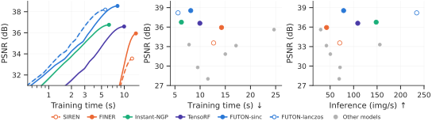
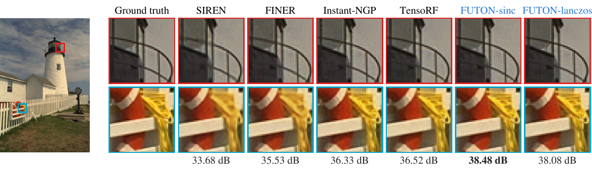
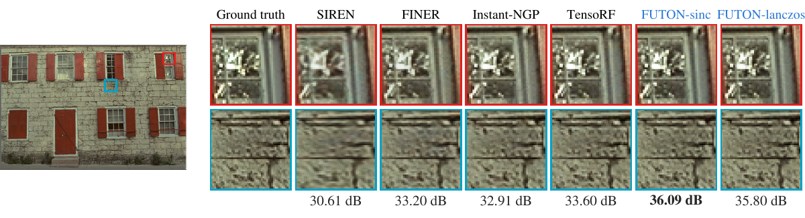
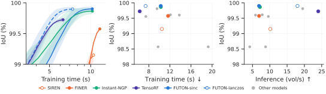
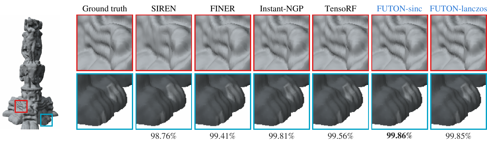
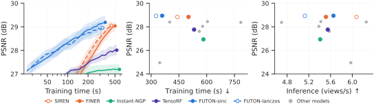
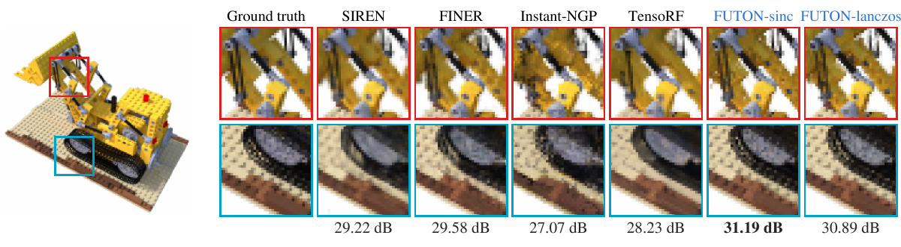
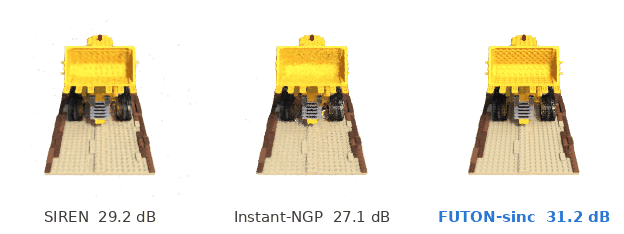
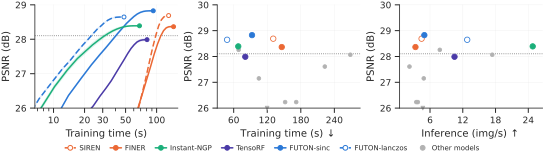
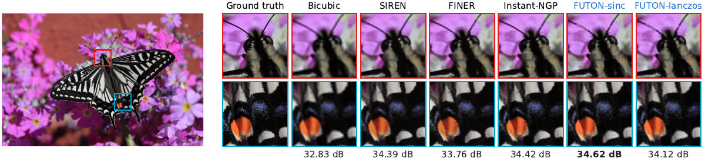

# Benchmarks

Twelve models on four tasks, at equal parameter count per task; the fourth, super-resolution, adds the deep image prior and three interpolations as references. The tables are `results/<task>/table.md` as `scripts/report_paper.py` writes them from the runs in `logs/`; the figures are the paper's. Bold marks the best value in a column and italics the second; ± is one standard error over the signals, after removing each signal's own level (a paired standard error).

Two notes on the rows. **TensoRF** is the variant its authors recommend for the dimension: CP on images (the only one in 2D) and VM on volumes and radiance fields; both are in the configs. **WIRE** is the real Gabor variant (`nf.RealWIRE`) from the WIRE paper and code.

Accuracy comes from the benchmark sweeps. Times are measured separately: every model was retrained alone on an exclusive A100 node after a warm-up pass, on all 24 images and 5 shapes, on the lego and hotdog scenes and on DIV2K images 0801 and 0882, and the tables and figures take their training times from those runs, so a radiance-field or super-resolution time is the mean over its two timed signals. The inference rates in the throughput panels come from the same kind of job (`scripts/profile_speed.py`). The sweeps' own times were within 6 % of the exclusive ones on radiance fields and within 12 % on super-resolution; the image and volume sweeps ran on a busier cluster, where Instant-NGP came out 1.7× slower beside its neighbours.

## Images

24 Kodak images at 768 × 512, about 195k parameters per model, 2000 epochs on 10 % of the pixels per step, scored on every pixel.

| Model | Params (k) | Train time (s) ↓ | PSNR (dB) ↑ | SSIM (%) ↑ | LPIPS ↓ |
| --- | --- | --- | --- | --- | --- |
| RFF | 199.7 | 9.5 | 29.80 ± 0.13 | 82.06 ± 0.84 | 0.3013 ± 0.0070 |
| PE-MLP | 196.7 | 11.5 | 28.03 ± 0.12 | 73.43 ± 1.36 | 0.4191 ± 0.0070 |
| MFN | 198.1 | 24.7 | 35.62 ± 0.16 | 92.16 ± 0.24 | 0.1567 ± 0.0042 |
| SIREN | 198.9 | 12.7 | 33.56 ± 0.15 | 90.69 ± 0.27 | 0.1986 ± 0.0050 |
| Gauss | 198.9 | 15.0 | 31.84 ± 0.22 | 86.48 ± 0.58 | 0.2292 ± 0.0052 |
| WIRE | 199.3 | 17.1 | 33.14 ± 0.41 | 89.20 ± 0.95 | 0.1909 ± 0.0117 |
| FINER | 198.9 | 14.3 | 35.94 ± 0.11 | 93.62 ± 0.26 | 0.1303 ± 0.0032 |
| Instant-NGP | 195.3 | 18.8 | 36.76 ± 0.12 | 93.84 ± 0.18 | 0.1274 ± 0.0030 |
| TensoRF | 202.0 | 9.9 | 36.59 ± 0.12 | 93.43 ± 0.21 | 0.1390 ± 0.0029 |
| GA-Planes | 194.8 | *7.8* | 33.24 ± 0.19 | 89.24 ± 0.39 | 0.2094 ± 0.0048 |
| FUTON-sinc | 194.4 | 8.1 | **38.54** ± 0.10 | **95.53** ± 0.34 | **0.0976** ± 0.0026 |
| FUTON-lanczos | 194.4 | **6.1** | *38.20* ± 0.10 | *95.24* ± 0.34 | *0.0998* ± 0.0026 |

<figure markdown="span">
  { width="960" }
  <figcaption>PSNR against training time for FUTON and the strongest model of each family, the band one within-image standard error; every model's final PSNR against its training time; and against its inference rate, in images per second.</figcaption>
</figure>

<figure markdown="span">
  
  
  <figcaption>kodim19 and kodim01: two regions of fine detail magnified for the ground truth and every featured model, with each model's PSNR over the whole image.</figcaption>
</figure>

## Occupancy

Five Stanford shapes voxelized at $256^3$, about 132k parameters per model, 2000 epochs on 1 % of the voxels per step, scored by IoU on every voxel.

| Model | Params (k) | Train time (s) ↓ | Armadillo | Dragon | Happy Buddha | Lucy | Thai Statue | Mean IoU (%) ↑ |
| --- | --- | --- | --- | --- | --- | --- | --- | --- |
| RFF | 132.2 | *7.4* | 99.85 | 99.84 | 99.68 | 98.76 | 99.66 | 99.56 ± 0.18 |
| PE-MLP | 131.3 | 9.8 | 98.96 | 98.53 | 98.96 | 98.21 | 98.19 | 98.57 ± 0.14 |
| MFN | 133.8 | 19.3 | 99.16 | 97.99 | 97.93 | 98.64 | 99.12 | 98.57 ± 0.29 |
| SIREN | 132.9 | 10.5 | 99.00 | 99.34 | 99.57 | 99.09 | 98.76 | 99.15 ± 0.14 |
| Gauss | 132.9 | 12.1 | 99.70 | 99.75 | 99.59 | 99.62 | 99.41 | 99.61 ± 0.05 |
| WIRE | 133.4 | 13.8 | 99.65 | 99.70 | 99.60 | 99.60 | 99.45 | 99.60 ± 0.04 |
| FINER | 132.9 | 11.7 | 99.54 | 99.67 | 99.70 | 99.56 | 99.41 | 99.58 ± 0.05 |
| Instant-NGP | 132.4 | 17.2 | 99.91 | *99.90* | 99.81 | **99.90** | 99.81 | 99.87 ± 0.04 |
| TensoRF | 130.0 | **6.3** | 99.82 | 99.86 | 99.80 | 99.59 | 99.57 | 99.73 ± 0.03 |
| GA-Planes | 132.0 | 9.5 | 99.81 | 99.86 | 99.88 | 99.79 | 99.72 | 99.81 ± 0.04 |
| FUTON-sinc | 131.7 | 10.3 | **99.95** | **99.91** | **99.92** | 99.87 | **99.86** | **99.90** ± 0.03 |
| FUTON-lanczos | 131.7 | 7.5 | **99.95** | *99.90* | **99.92** | *99.88* | *99.85* | **99.90** ± 0.03 |

<figure markdown="span">
  { width="960" }
  <figcaption>IoU against training time for the featured models; every model's final IoU against its training time; and against its inference rate, in volumes per second.</figcaption>
</figure>

<figure markdown="span">
  
  <figcaption>The Thai statue, reconstructed from each model's checkpoint by marching cubes and rendered offscreen.</figcaption>
</figure>

## Radiance fields

Eight NeRF synthetic (Blender) scenes under FINER's protocol: 200 × 200 views, 25 training views, 37,500 steps of 4096 rays, scored on all 200 test views. Every model is the density network of the same radiance field (15 geometry features, spherical-harmonics direction encoding, a 64 × 2 colour MLP), about 75k parameters in all.

| Model | Params (k) | Train time (s) ↓ | PSNR (dB) ↑ | SSIM (%) ↑ | LPIPS ↓ |
| --- | --- | --- | --- | --- | --- |
| RFF | 74.5 | *346.3* | 24.95 ± 0.61 | 86.94 ± 1.70 | 0.2168 ± 0.0174 |
| PE-MLP | 86.0 | 400.1 | 28.41 ± 0.13 | 93.53 ± 0.24 | 0.0720 ± 0.0044 |
| MFN | 75.8 | 784.5 | 28.38 ± 0.16 | 93.30 ± 0.20 | 0.0743 ± 0.0034 |
| SIREN | 75.2 | 441.6 | 28.84 ± 0.12 | 93.71 ± 0.19 | 0.0976 ± 0.0093 |
| Gauss | 75.2 | 560.2 | 27.63 ± 0.13 | 92.35 ± 0.16 | 0.1050 ± 0.0069 |
| WIRE | 74.5 | 604.3 | 28.45 ± 0.14 | 93.11 ± 0.12 | 0.1127 ± 0.0042 |
| FINER | 75.2 | 501.9 | 28.85 ± 0.15 | 93.59 ± 0.22 | 0.1157 ± 0.0127 |
| Instant-NGP | 75.0 | 812.9 | 26.94 ± 0.16 | 91.74 ± 0.35 | 0.1001 ± 0.0061 |
| TensoRF | 74.8 | 532.0 | 27.76 ± 0.24 | 93.13 ± 0.31 | 0.0750 ± 0.0053 |
| GA-Planes | 75.0 | 578.0 | 28.04 ± 0.27 | 93.58 ± 0.43 | 0.0698 ± 0.0050 |
| FUTON-sinc | 74.1 | 359.5 | **28.95** ± 0.29 | **94.31** ± 0.44 | **0.0660** ± 0.0061 |
| FUTON-lanczos | 74.1 | **327.0** | *28.93* ± 0.28 | *94.26* ± 0.46 | *0.0662* ± 0.0060 |

Per scene, the picture is mixed, which the mean hides: FUTON leads on lego, materials, hotdog and ship, and trails FINER and SIREN on chair, drums, ficus and mic.

| Model | Chair | Drums | Ficus | Hotdog | Lego | Materials | Mic | Ship |
| --- | --- | --- | --- | --- | --- | --- | --- | --- |
| RFF | 28.36 | 19.89 | 26.13 | 26.97 | 23.72 | 23.00 | 31.67 | 19.87 |
| PE-MLP | 32.72 | 23.81 | 26.89 | 32.06 | 29.51 | 26.47 | 32.63 | 23.18 |
| MFN | 33.01 | 23.73 | 27.48 | 32.82 | 28.80 | 25.59 | 33.23 | 22.37 |
| SIREN | *33.21* | *24.59* | **27.96** | 32.84 | 29.22 | 26.58 | **33.82** | 22.51 |
| Gauss | 31.44 | 23.69 | 26.42 | 32.01 | 27.77 | 25.22 | 32.37 | 22.08 |
| WIRE | 32.50 | 24.22 | 27.77 | 32.43 | 28.83 | 26.20 | *33.53* | 22.11 |
| FINER | **33.47** | **24.62** | *27.85* | *33.23* | 29.58 | 26.19 | 33.41 | 22.42 |
| Instant-NGP | 31.18 | 22.46 | 26.03 | 31.20 | 27.07 | 24.62 | 32.28 | 20.67 |
| TensoRF | 31.74 | 23.90 | 26.15 | 32.26 | 28.23 | 26.05 | 31.14 | 22.65 |
| GA-Planes | 31.98 | 23.69 | 25.42 | 31.96 | 29.56 | 26.55 | 32.27 | 22.89 |
| FUTON-sinc | 33.01 | 24.38 | 27.00 | 33.08 | **31.19** | **27.29** | 32.45 | *23.19* |
| FUTON-lanczos | 32.97 | 24.09 | 26.82 | **33.61** | *30.89* | *27.23* | 32.61 | **23.21** |

Test-view PSNR in dB. `results/nerf/table.md` also lists SSIM and LPIPS per scene.

<figure markdown="span">
  { width="960" }
  <figcaption>Validation PSNR against training time for the featured models; every model's final test PSNR against its training time; and against its rendering rate, in views per second.</figcaption>
</figure>

<figure markdown="span">
  
  <figcaption>The lego scene from a test view, with two regions magnified.</figcaption>
</figure>

<figure markdown="span">
  { width="720" }
  <figcaption>The same scene in orbit: SIREN, Instant-NGP and FUTON-sinc, with their test-view PSNR.</figcaption>
</figure>

## Super-resolution

The 100 DIV2K validation images, observed at a quarter of their size. Each image, about 2040 × 1356 pixels, is downsampled 4× with the antialiased bicubic filter of MATLAB's `imresize`, the standard protocol, and the models see nothing but the result, about 510 × 339 pixels. A field maps the high-resolution coordinates to RGB and is trained through the downsampling operator: a step draws 5 % of the low-resolution pixels in 8 × 8 blocks, evaluates the field at the high-resolution pixels beneath them (about 260k evaluations), downsamples the result with the same filter and takes the L1 distance to the observed pixels, for 2000 steps at about 500k parameters per model. The deep image prior (DIP) trains its convolutional generator through the same operator and joins nearest, bilinear and bicubic interpolation as a reference row. FUTON's grid of components is the low-resolution size, K = (H/4, W/4), and its rank the largest within the budget on each image (399 on 0882), since the grid follows the image's size where the baselines' widths do not. Every model's scale and learning rate were chosen on three DIV2K training images (0395, 0431 and 0777) by the mean gain over bicubic, with the L1 loss throughout. PSNR and SSIM are computed on the luma channel after shaving a 4-pixel border, LPIPS on RGB, all against the original image.

| Model | Params (k) | Train time (s) ↓ | PSNR (dB) ↑ | SSIM (%) ↑ | LPIPS ↓ |
| --- | --- | --- | --- | --- | --- |
| Nearest | – | – | 26.73 ± 0.08 | 73.35 ± 0.13 | 0.4588 ± 0.0047 |
| Bilinear | – | – | 27.53 ± 0.04 | 75.71 ± 0.15 | 0.3679 ± 0.0024 |
| Bicubic | – | – | 28.10 ± 0.04 | 77.49 ± 0.16 | **0.3526** ± 0.0026 |
| DIP | 505.3 | 268.5 | 28.07 ± 0.05 | 75.77 ± 0.19 | 0.4173 ± 0.0044 |
| RFF | 500.0 | 105.0 | 27.15 ± 0.09 | 73.50 ± 0.22 | 0.4463 ± 0.0028 |
| PE-MLP | 502.1 | 119.8 | 22.61 ± 0.21 | 61.35 ± 0.57 | 0.5801 ± 0.0045 |
| MFN | 501.8 | 222.9 | 27.61 ± 0.10 | 75.04 ± 0.20 | 0.4280 ± 0.0022 |
| SIREN | 500.6 | 130.7 | *28.69* ± 0.07 | *77.90* ± 0.11 | 0.3759 ± 0.0022 |
| Gauss | 500.6 | 152.0 | 26.23 ± 0.10 | 61.67 ± 0.53 | 0.5199 ± 0.0067 |
| WIRE | 502.0 | 171.8 | 26.23 ± 0.07 | 70.90 ± 0.23 | 0.4900 ± 0.0023 |
| FINER | 500.6 | 145.9 | 28.37 ± 0.06 | 75.07 ± 0.16 | 0.3991 ± 0.0031 |
| Instant-NGP | 505.2 | *68.2* | 28.39 ± 0.06 | 77.01 ± 0.10 | 0.3783 ± 0.0021 |
| TensoRF | 500.4 | 80.7 | 27.99 ± 0.04 | 76.31 ± 0.12 | 0.4020 ± 0.0025 |
| GA-Planes | 501.3 | 68.8 | 28.26 ± 0.05 | 76.74 ± 0.09 | 0.3927 ± 0.0020 |
| FUTON-sinc | 499.3 | 92.8 | **28.83** ± 0.07 | **78.96** ± 0.18 | *0.3672* ± 0.0020 |
| FUTON-lanczos | 499.3 | **48.2** | 28.65 ± 0.06 | *77.90* ± 0.17 | 0.3856 ± 0.0022 |

<figure markdown="span">
  { width="960" }
  <figcaption>PSNR against training time for FUTON and the strongest model of each family, with bicubic interpolation as the dotted level; every model's final PSNR against its training time; and against its inference rate, in images per second.</figcaption>
</figure>

<figure markdown="span">
  
  <figcaption>DIV2K 0882: two regions magnified for the original and every featured model, with each model's PSNR over the whole image; bicubic interpolation reaches 32.83 dB on it.</figcaption>
</figure>

Super-resolution is the hardest task here for every model: nothing but the low-resolution image is seen, so the margins are fractions of a decibel and several fields lose to bicubic interpolation. FUTON-sinc beats bicubic on 99 of the 100 images, by 0.72 dB on average and 1.8 dB on 0882, and leads PSNR and SSIM; SIREN (ahead of bicubic on 90 images) and FUTON-lanczos (on 94, in 48 s, the fastest trained model) follow within 0.2 dB. Instant-NGP, FINER and GA-Planes gain 0.15 to 0.3 dB on average but lose to bicubic on more than a third of the images; the deep image prior and TensoRF do not beat it. Bicubic keeps the best LPIPS, by 0.015 over FUTON-sinc, which suggests the fields buy their PSNR at edges rather than in texture, the one thing a single low-resolution image cannot teach. PE-MLP is unstable under the L1 loss: the learning rate chosen on the tuning images still fails on 14 of the 100, which end below 20 dB and drag its mean to 22.6 dB.

## Reading the numbers

- **Accuracy.** FUTON leads every column of the image table by a margin well beyond the error bars (1.8 dB over Instant-NGP), and the mean IoU on volumes, where the hash grid is its only close competitor. On radiance fields the mean is a narrow lead over FINER and SIREN, within one standard error; on super-resolution the lead over SIREN is 0.14 dB and holds on 76 of the 100 images.
- **Speed.** FUTON-lanczos is the fastest model to train on images, radiance fields and super-resolution; on volumes RFF and TensoRF train faster but reach a lower IoU. Instant-NGP, the other strong model, is 1.4 to 3× slower than FUTON here; its hash grid runs in plain PyTorch, like every other model, rather than in tiny-cuda-nn's fused kernels.
- **The two bases** trade a little accuracy for speed: Lanczos costs 0.3 dB on images, 0.2 dB on super-resolution and nothing on volumes or radiance fields. It trains about a quarter faster on images and volumes, 9 % faster on radiance fields, where ray marching sets the pace, and twice as fast on super-resolution, where a step evaluates seven times more points than on images and the per-point cost of a dense basis shows.

The [ablations](ablations.md) take FUTON apart, and [Reproducing the paper](reproduce.md) has the commands that produced every number above.
