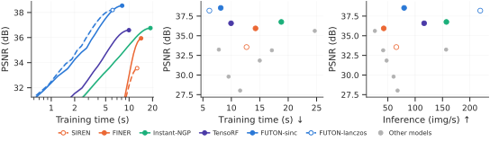
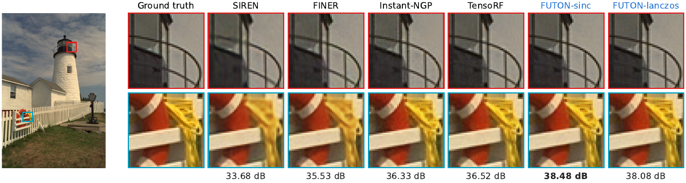

---
hide:
  - navigation
  - toc
---

# NeuroField

**Neural fields in PyTorch.** A signal is fitted as a function of its coordinates: NeuroField provides FUTON, the Fourier Tensor Network of the paper, eleven baselines behind the same interface, coordinate datasets for images, volumes and posed views, and the training loops and scripts that produce the paper's numbers.

<figure markdown="span">
  { width="960" }
  <figcaption>FUTON evaluates a fixed basis on each coordinate axis, combines the axes with a low-rank tensor network, and decodes the result with a linear map or a small MLP.</figcaption>
</figure>

```python
import torch
import neurofield as nf

model = nf.FUTON(
    in_features=2,
    out_features=3,
    basis=("sinc", {"num_components": 256}),
    combiner=("cp", {"rank": 224}),
    decoder=("mlp", {"hidden_layers": 1}),
    output_activation=torch.tanh,
)
rgb = model(torch.rand(4096, 2) * 2 - 1)  # coordinates in [-1, 1]^2 -> (4096, 3)
```

<div class="grid cards" markdown>

-   :material-rocket-launch:{ .lg .middle } **Getting started**

    ---

    Install the package, fit an image in a dozen lines, and read what the training loop returns.

    [:octicons-arrow-right-24: Installation](getting-started/installation.md) · [Quick start](getting-started/quickstart.md)

-   :material-book-open-variant:{ .lg .middle } **Concepts**

    ---

    How a neural field, a dataset and the training loop fit together, and how FUTON is built from a basis, a combiner and a decoder.

    [:octicons-arrow-right-24: Neural fields](concepts/neural-fields.md) · [FUTON](concepts/futon.md)

-   :material-school:{ .lg .middle } **Tutorials**

    ---

    Images, occupancy volumes, radiance fields, image compression, and writing your own components.

    [:octicons-arrow-right-24: Tutorials](tutorials/index.md)

-   :material-chart-line:{ .lg .middle } **Experiments**

    ---

    The benchmark protocol, every table and figure of the paper, the ablations, and how to reproduce them from the configs.

    [:octicons-arrow-right-24: Benchmarks](experiments/benchmarks.md) · [Reproduce](experiments/reproduce.md)

-   :material-code-braces:{ .lg .middle } **API reference**

    ---

    Every public class and function, with tensor shapes, defaults and the paper's equations.

    [:octicons-arrow-right-24: API](api/index.md)

-   :material-lifebuoy:{ .lg .middle } **Troubleshooting**

    ---

    Coordinate ranges, memory, backends, and the other things that go wrong first.

    [:octicons-arrow-right-24: Troubleshooting](troubleshooting.md)

</div>

## Why FUTON

Most implicit neural representations hide their prior in the nonlinearity: sines, Gabor wavelets, Gaussians, or a hash-grid lookup in front of a ReLU network. FUTON puts the prior in the parameterization. The signal is expanded in a fixed, analytic basis along each coordinate axis, and the coefficient tensor of that expansion is kept in low-rank canonical polyadic (CP) form. The model is then a shallow, parallel tensor contraction rather than a deep network:

- **Fast.** One point costs $O(CKR)$ for $C$ axes, $K$ basis functions per axis and rank $R$. A compactly supported basis such as Lanczos touches only $2a$ taps per axis, and fused Triton kernels contract them without ever forming the dense features.
- **Accurate at equal size.** At matched parameter counts FUTON leads every baseline on the average of each benchmark: Kodak images, Stanford occupancy volumes and Blender radiance fields.
- **Transparent.** With a linear decoder, FUTON *is* a rank-$R$ CP model of the signal in the chosen basis, so bandwidth ($K$) and capacity ($R$) are explicit knobs with a meaning.

## Results at a glance

All models are trained at the same parameter count per task, with Adam and a shared schedule, on one A100. Times are mean training times per signal; see [Benchmarks](experiments/benchmarks.md) for every model, metric and error bar.

| Task | Signals | Params | FUTON-sinc | FUTON-lanczos | Strongest baseline |
| --- | --- | --- | --- | --- | --- |
| Images (Kodak) | 24 | 195k | **38.54 dB** in 8.1 s | 38.20 dB in **6.6 s** | Instant-NGP, 36.76 dB in 26.9 s |
| Occupancy (Stanford) | 5 | 132k | **99.90 % IoU** in 11.2 s | **99.90 % IoU** in 8.8 s | Instant-NGP, 99.87 % in 26.7 s |
| Radiance fields (Blender) | 8 | 75k | **28.95 dB** in 343 s | 28.93 dB in **315 s** | FINER, 28.85 dB in 445 s |

<figure markdown="span">
  { width="960" }
  <figcaption>Kodak: PSNR against training time for FUTON and the strongest model of each family (the band is one within-image standard error); every model's final PSNR against its training time; and against its inference rate.</figcaption>
</figure>

<figure markdown="span">
  
  <figcaption>kodim19 at about 195k parameters. The two boxed regions are magnified for the ground truth and every featured model; the PSNR is over the whole image.</figcaption>
</figure>

## Citation

If you use NeuroField or FUTON in your research, please cite the paper:

```bibtex
@article{ashtari2026futon,
  title   = {{FUTON}: Fourier Tensor Network for Implicit Neural Representations},
  author  = {Ashtari, Pooya and Behmandpoor, Pourya and Deligiannis, Nikos and Pi{\v{z}}urica, Aleksandra},
  journal = {arXiv preprint arXiv:2602.13414},
  year    = {2026}
}
```

The code is released under the [MIT license](https://github.com/pashtari/neurofield/blob/main/LICENSE).
